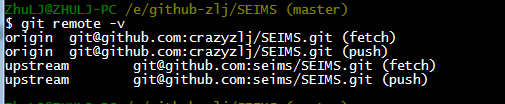

1. SEIMS开发API文档采用doxygen自动生成，相关配置文件在 /doc/doxygen
2. 模型原理梳理文档也在这里 /doc/theory
3. style文件夹内为PyCharm和CLion的代码风格配置文件
4. subtree文件为更新子库命令（master分支下进行）

# Tips

1. Insert an image

- Markdown format:

- Doxygen accepted format:

2. Insert an image with a specific width

2. [Workarounds for things not officially supported by Markdown](https://www.markdownguide.org/hacks/#overview)

