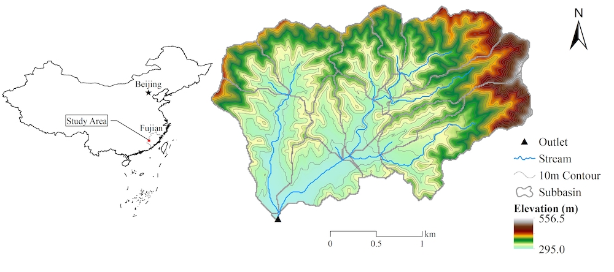
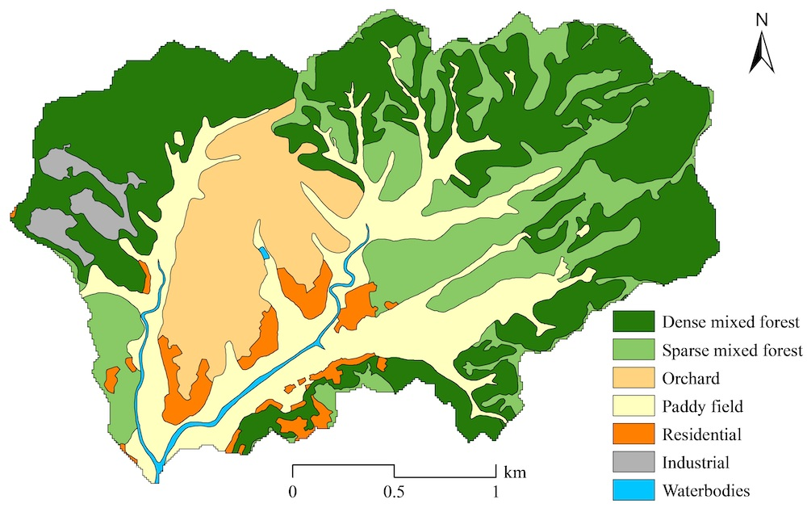

Data preparation of demo watershed {#getstart_data_preparation}
==========================================================

[TOC]

In simple terms, watershed modeling is to simulate the behavior of watershed such as runoff, soil erosion, and nutrient transfer using the empirical or physical formulas based on the geographic information data (e.g., digital elevation model [DEM], landuse map, and soil map), meteorological data, and management data, etc. Thus, data collection and preparation are the first key step for watershed modeling.
As a demo, data from the Youwuzhen watershed, Changting County, Fujian province, China, is selected for long-term (i.e., daily time-step) watershed modeling and application.

# Basic conventions of file formats
Basically, the input data of SEIMS-based watershed model includes two categories such as spatial data and plain text.
## Spatial data
Spatial data includes raster data and vector data. Theoretically, all formats of raster (https://www.gdal.org/formats_list.html) and vector (https://www.gdal.org/ogr_formats.html) data supported by GDAL are acceptable for SEIMS. Even though, the most commonly used GeoTIFF and ESRI Shapefile are highly recommended for raster and vector data, respectively.
+ Please make sure all spatial data have the same projected coordinate system, NOT geographic coordinate system.
+ The spatial extents of different raster data are not necessarily the same. However, the gridded cells at the same location are preferably coincident. Otherwise, the raster data will be interpolated based on the DEM data which may cause undesired distortion. 
## Plain text {#dataprep_basic_plaintest}
Except for the spatial data, almost all the other data can be provided as plain text. The basic conventions of plain text are designed as:
+ The line starts with number sign (`#`) will be regarded as a comment line and ignored by SEIMS. However, there is one exception when the first line of one plain text file is for recording the time-system and timezone, e.g., `#LOCALTIME 8` means date time recorded in the current file is east 8th district time and `#UTCTIME` means Coordinated Universal Time which is also known as Greenwich Mean Time (GMT).
+ The first valid line is headers if needed.
+ Comma (`,`) is the delimiter for values within each data line.
+ En dash (`-`) is the primary delimiter within each value while colon (`:`) is the secondary delimiter.

For example, the following plain text 
```
# This line is a comment.
SUBSCENARIO,NAME,LANDUSE,PARAMETERS
1, Closing measures,7-16,Interc_max:Maximum Interception Capacity:AC:1-Conductivity:Soil hydraulic conductivity:RC:3.5
``` 
can be parsed as a Python data structure of dictionary like:
```
demo_dict = {
    'SUBSCENARIO': 1,
    'NAME':'Closing measures'
    'LANDUSE': [7, 16],
    'PARAMETERS': [
        ['Interc_max', 'Maximum Interception Capacity', 'AC', 1],
        ['Conductivity', 'Soil hydraulic conductivity', 'RC', 3.5]        
    ]
}
```
# Spatial data
The demo data named Youwuzhen watershed (~5.39 km<sup>2</sup>) is located in Changting County of Fujian province, China ([Fig. Youwuzhen Map](@ref fig_ywz_loc)). It belongs to the typical red-soil hilly region in southeastern China and suffers from severe soil erosion. The study area has hills with steep slopes (up to 52.9° and with an average slope of 16.8°) and broad alluvial valleys. The elevation ranges from 295.0 m to 556.5 m. The landuse types are mainly forest (59.8%), paddy field (20.6%), and orchard (12.8%) ([Fig. Youwuzhen Landuse](@ref fig_ywz_lucc)). Soil types in the study area are red soil (78.4%) and paddy soil (21.6%) which can be classified as *Ultisols* and *Inceptisols* in US Soil Taxonomy, respectively ([Fig. Youwuzhen Soil Type](@ref fig_ywz_soiltype)).

To improve the computational efficiency for demonstration in this manual, the DEM (`ywzdem30m.tif`), landuse (`ywzlanduse30m.tif`), and soil (`ywzsoil30m.tif`) map are all unified to be of 30 m resolution.

\anchor fig_ywz_loc  

**Fig. Location of the demo watershed named Youwuzhen watershed**

\anchor fig_ywz_lucc  

**Fig. Landuse map of the Youwuzhen watershed**

\anchor fig_ywz_soiltype  

**Fig. Soil map of the Youwuzhen watershed**

The outlet location (i.e., as vector point) of the Youwuzhen watershed is prepared as ESRI Shapefile. If the outlet data cannot be predetermined, the location (i.e., center of the gridded cell) with largest flow accumulation will be marked as the outlet of the current study area.

In the current version of SEIMS, the Thiessen polygon of meteorological stations and precipitation stations that covers the entire watershed should also be provided as vector polygon data, e.g., `thiessen_meteo.shp` and `thiessen_pcp.shp`, respectively. The attributes of each polygon should include the unique ID (`ID`) which is coincident with station ID introduced in the following section, station name (`Name`), X and Y coordinates under the projected coordinate system (`LocalX` and `LocalY`), latitude and longitude under the WGS84 coordinate system (`Lat` and `Lon`), and altitude (`Elevation`).

> **TODO**: The requirements of the Thiessen polygon of meteorological stations and precipitation stations should be removed since the spatial information of these stations presented as plain text (see [here](@ref dataprep_spatial_pcp_station)) can provide similar information.

All these spatial data are in `SEIMS\data\youwuzhen\data_prepare\spatial`.

# Precipitation data
The annual average precipitation of the Youwuzhen watershed is 1697.0 mm and intense short-duration thunderstorm events contribute about three-quarters of annual precipitation from March to August.
## Spatial information of precipitation station {#dataprep_spatial_pcp_station}
The fields of spatial information of precipitation station are shown in [Tab. Precipitation Station](@ref tab_pcpstation).

\anchor tab_pcpstation **Tab. Fields of precipitation station**

|      Field name     |      Datatype     |      Description     |
|---|---|---|
|     StationID    |     Integer    |     Unique station ID    |
|     Name    |     String    |     Station name    |
|     LocalX    |     Float    |     X coordinates (unit: m) under the projected coordinate system    |
|     LocalY    |     Float    |     Y coordinates (unit: m)    |
|     Lat    |     Float    |     Latitude (unit: degree) under the WGS84 coordinate system    |
|     Lon    |     Float    |     Longitude (unit: degree)    |
|     Elevation    |     Float    |     Altitude (unit: m)    |

For example, `SEIMS\data\youwuzhen\data_prepare\climate\Sites_P.csv`:
```
StationID,Name,LocalX,LocalY,Lon,Lat,Elevation
81502750,HeTianZhan,39444759.232,2840563.152,116.4,25.683333,298
```

## Records of precipitation data
The first line is to state the time-system and time zone (see [here](@ref dataprep_basic_plaintest)). If not provided, `#UTCTIME` will be regarded as the default.
The fields and formats of precipitation data are as follows.

\anchor tab_pcp_dataitem **Tab. Fields and formats of precipitation data item**

|      Field name     |      Datatype     |      Description     |
|---|---|---|
|     DATETIME    |     Datetime string    |     Date time with the format of `YYYY-MM-DD HH:MM:SS`    |
|     StationIDs    |     Float    |     Precipitation value for each Station IDs. Multiple stations can be `StationID1`,`StationID2`, … `StationIDN`    |

Thus, the records of precipitation data are something like (`SEIMS\data\youwuzhen\data_prepare\climate\pcp_daily.csv`):
```
#UTCTIME
DATETIME,81502750
2012-01-01 00:00:00,0
2012-01-02 00:00:00,0
2012-01-03 00:00:00,9.00
2012-01-04 00:00:00,16.50
2012-01-05 00:00:00,16.00
2012-01-06 00:00:00,1.50
```

# Meteorological data
The Youwuzhen watershed is characterized by a mid-subtropical monsoon moist climate and has an annual average temperature of 18.3 °C. 
The format of meteorological station is the same as that of precipitation station (see [here](@ref dataprep_spatial_pcp_station)), e.g., `SEIMS\data\youwuzhen\data_prepare\climate\Sites_M.csv`.

Same to precipitation data, the first line of meteorological data text is to state the time-system and timezone (see [here](@ref dataprep_basic_plaintest)). If not provided, `#UTCTIME` will be regarded as default. The fields and formats of meteorological data are as follows. **Note that there is no fixed order of these fields.**

\anchor tab_meteo_dataitem **Tab. Fields and formats of meteorological data item**

|      Field name     |      Datatype     |      Description     |
|---|---|---|
|     StationID    |     Integer    |     Station ID    |
|     DATETIME    |     Datetime string    |     Date time with the format of YYYY-MM-DD HH:MM:SS    |
|     TMAX    |     Float    |     Maximum temperature (unit: degC)    |
|     TMIN    |     Float    |     Minimum temperature (unit: degC)    |
|     TMEAN    |     Float    |     (Optional) Mean temperature (unit: degC)    |
|     RM    |     Float    |     Relative moisture (unit: %)    |
|     WS    |     Float    |     Wind speed (unit: m/s)    |
|     SR or SSD    |     Float    |     Solar radiation (units: MJ/m2/day) or sunshine duration hour (unit:   hr)    |
|     PET    |     Float    |     Potential evapotranspiration (mm)    |

Thus, the records of meteorological data are something like (`SEIMS\data\youwuzhen\data_prepare\climate\meteo_daily.csv`):
```
#LOCALTIME 8
StationID,DATETIME,TMEAN,TMAX,TMIN,RM,WS,SSD
58911,2012-01-01 20:00:00,10.0 ,13.6 ,7.8 ,76 ,1.2 ,1.2
58911,2012-01-02 20:00:00,10.6 ,15.7 ,7.0 ,73 ,0.7 ,1.5
58911,2012-01-03 20:00:00,7.1 ,12.0 ,4.6 ,89 ,1.6 ,0.0
58911,2012-01-04 20:00:00,3.9 ,6.6 ,2.5 ,78 ,1.7 ,0.0
```

Besides, the units of each type of data should also be provided, e.g., `SEIMS\data\youwuzhen\data_prepare\climate\Variables.csv`.

> **TODO**: In the current version of SEIMS, the units should be the same as Table 3. However, some unit convert functions should be added in the future to make SEIMS more compatible with commonly used units.

# Observed data
The periodic site-monitoring streamflow, sediment, or nutrient data collected within the watershed are regarded as observed data. The observed data is organized as one site information file and several data files corresponding to the number of monitoring sites and monitoring variables.
## Spatial information of monitoring sites
The fields of spatial information of monitoring sites are as follows. 

\anchor tab_obs_site **Tab. Fields of monitoring site data**

|      Field name     |      Datatype     |      Description     |
|---|---|---|
|     StationID    |     Integer    |     Unique station ID    |
|     Name    |     String    |     Station name    |
|     Type    |     String    |     Monitoring variables, use En dash as separator for multiple variables.   Avoid En dash in each single Type.    |
|     Unit    |     String    |     Units of monitoring variables, use En dash as separator for multiple units.   Avoid En dash in each single Unit.    |
|     LocalX    |     Float    |     X coordinates (unit: m) under the projected coordinate system    |
|     LocalY    |     Float    |     Y coordinates (unit: m)    |
|     Lat    |     Float    |     Latitude (unit: degree) under the WGS84 coordinate system    |
|     Lon    |     Float    |     Longitude (unit: degree)    |
|     Elevation    |     Float    |     Altitude (unit: m)    |
|     isOutlet    |     Integer    |     Types of monitoring site:<br>     1: The outlet of   watershed<br>     2: The outlet of one   subbasin<br>     3: The junction of   multiple subbasins<br>     0: Other spatial   location    |

For example, `SEIMS\data\youwuzhen\data_prepare\observed\SiteInfo.csv`:
```
StationID,Name,Type,Lat,Lon,LocalX,LocalY,Unit,Elevation,isOutlet
1,hetianzhan,SED,25.680207,116.406401,440409.511725,2841541.17804,g/L,280,1
1,hetianzhan,Q,25.680207,116.406401,440409.511725,2841541.17804,m3/s,280,1
```

Note that the observed data is primarily used for postprocessing such as matching to the corresponding simulated values. Thus, the `Type` should be accord with the output of SEIMS-based watershed model. All the currently available outputs can be found in `SEIMS\seims\preprocess\database\AvailableOutputs.csv`. For example, if the total nitrogen data is monitored, the type should be `CH_TN` according to the value of the `FILENAME` field (obviously, not include the suffix, e.g., `.txt`) in the output item of total nitrogen amount in reach:
```
MODULE_CLASS,OUTPUTID,DESCRIPTION,UNIT,TYPE,STARTTIME,ENDTIME,INTERVAL,INTERVAL_UNIT,SUBBASIN,FILENAME,USE
NutrientTransport,CH_TN,total nitrogen amount in reach,kg,NONE,1970-01-01 00:00:00,1970-01-01 00:00:00,-9999,-9999,ALL,CH_TN.txt,0
```

## Records of observed data
Like the format of precipitation data, the first line is optionally to state the time-system and timezone (see [here](@ref dataprep_basic_plaintest)). If not provided, `#UTCTIME` will be regarded as the default.
The fields and formats of observed data are as follows.

\anchor tab_obs_dataitem **Tab. Fields and formats of observed data item**

|      Field name     |      Datatype     |      Description     |
|---|---|---|
|     StationID    |     Integer    |     Station ID    |
|     DATETIME    |     Datetime string    |     Date time with the format of YYYY-MM-DD HH:MM:SS    |
|     Type    |     String    |     Monitoring variable    |
|     VALUE    |     Float    |     Monitoring value of current variable at the current date time    |

Thus, the records of observed data are something like (`SEIMS\data\youwuzhen\data_prepare\observed\observed_Q.csv`):
```
#UTCTIME
StationID,DATETIME,Type,VALUE
1,2012-01-14 00:00:00,Q,0.1615
1,2012-01-15 00:00:00,Q,0.578
1,2012-01-16 00:00:00,Q,0.4317
```

# Lookup tables
Lookup tables, including crop, fertilizer, tillage, lanuse, soil, and urban, are adopted from SWAT and predefined in `SEIMS\seims\preprocess\database`. Parameters specific to study areas can be appended to these lookup tables or prepared in separate files in `SEIMS\data\youwuzhen\data_prepare\lookup`.
The details of the most common used lookup tables are as follows. 
## Soil properties
Soil properties include physical properties and chemical properties. The fields and descriptions are shown in [Tab. Soil Lookup](@ref tab_soil_lookup). The optional parameters can be omitted.
Note that the `SEQN` and `NAME` may not be consistent with soil types (`SOILCODE`), so that to represent heterogeneity of the same soil type according to different landcover or topographic positions. However, the `SEQN` **MUST** be consistent with the values in soil map, i.e., `ywzsoil30m.tif`. The soil properties of multiple layers are concatenated with En dash (`-`) as described in [here](@ref dataprep_basic_plaintest).

\anchor tab_soil_lookup **Tab. Fields and description in lookup table of soil properties**

|      Field name     |      Datatype     |      Unit     |      Description     |
|---|---|---|---|
|     SEQN or SOILCODE    |     Integer    |     -    |     Unique identifier of soil map    |
|     NAME    |     String    |     -    |     Soil name    |
|     SOILLAYERS    |     Integer    |     -    |     Number of soil layers    |
|     SOL_Z    |     Float array    |     mm    |     Depth from soil surface to bottom of layer    |
|     SOL_OM    |     Float array    |     %    |     Organic matter content    |
|     SOL_CLAY    |     Float array    |     %    |     Clay content, diameter D < 0.002 mm    |
|     SOL_SILT    |     Float array    |     %    |     Silt content, 0.002 mm < D < 0.05 mm    |
|     SOL_SAND    |     Float array    |     %    |     Sand content, 0.05 mm < D < 2 mm    |
|     SOL_ROCK    |     Float array    |     %    |     Rock fragment content, D > 2 mm    |
|     SOL_BD    |     Float array    |     Mg/m<sup>3</sup>    |     Moist bulk density, value ranges 1.1 ~ 1.9    |
|     SOL_AWC    |     Float array    |     mm    |     Available water capacity    |
|     SOL_ZMX    |     Float    |     mm    |     (Optional) Maximum rooting depth of soil profile    |
|     ANION_EXCL    |     Float    |     -    |     (optional) Fraction of porosity (void space) from which anions are   excluded, default is 0.5    |
|     SOL_CRK    |     Float    |     -    |     (optional) Potential or maximum crack volume of the soil profile   expressed as a fraction of the total soil volume.    |
|     SOL_K    |     Float array    |     mm/hr    |     (optional) Saturated hydraulic conductivity    |
|     SOL_WP    |     Float array    |     mm    |     (optional) Wilting point    |
|     SOL_FC    |     Float array    |     mm    |     (optional) Field capacity     |
|     SOL_POROSITY    |     Float array    |     -    |     (optional) Porosity    |
|     SOL_USLE_K    |     Float array    |     -    |     (optional) USLE K factor    |
|     SOL_ALB    |     Float    |     -    |     (optional) Albedo when soil is moist    |
|     ESCO    |     Float    |     -    |     (optional) Soil evaporation compensation factor, the default is 0.95    |
|     SOL_NO3    |     Float array    |     g/kg    |     (optional) concentration of nitrate    |
|     SOL_NH4    |     Float array    |     g/kg    |     (optional) concentration of ammonium-N in soil    |
|     SOL_ORGN    |     Float array    |     g/kg    |     (optional) concentration of organic nitrogen     |
|     SOL_ORGP    |     Float array    |     g/kg    |     (optional) concentration of organic phosphorus    |
|     SOL_SOLP    |     Float array    |     g/kg    |     (optional) concentration of soluble phosphorus    |

Thus, the lookup table of soil properties of specific study area is something like (`SEIMS\data\youwuzhen\data_prepare\lookup\soil_properties_lookup.csv`):
```
SEQN,SNAM,SOILLAYERS,SOL_ZMX,SOL_Z,SOL_BD,SOL_OM,SOL_CLAY,SOL_SILT,SOL_SAND,SOL_ROCK,SOL_WP,SOL_FC,SOL_POROSITY,SOL_K,SOL_AWC,SOL_NO3,SOL_NH4,SOL_ORGN,SOL_SOLP,SOL_ORGP
201,WNT,3,600,200-400-600,1.5-1.57-1.45,2.31-0.84-0.84,15.66-17.36-20.94,13.8-17.31-22.23,52.25-44.6-35.9,18.29-20.73-20.93,0.12-0.14-0.18,0.21-0.24-0.31,0.44-0.41-0.45,26.16-11.43-7.87,0.1-0.1-0.13,0.004-0.002-0.002,0-0-0,0.164-0.079-0.077,0.005-0.002-0.001,0.047-0.018-0.012
```

## Initial landcover parameters
Some parameters of landcover at the beginning of simulation should be defined. The fields and descriptions are shown in [Tab. LUCC Lookup](@ref tab_soil_lookup). Please refers to the predefined database `seims/preprocess/database/CropLookup.csv` and `LanduseLookup.csv`.

\anchor tab_lucc_lookup **Tab. Fields and descriptions in the lookup table of initial landcover parameters**

|      Field name     |      Datatype     |      Unit     |      Description     |
|---|---|---|---|
|     LANDUSE_ID    |     Integer    |     -    |     Landuse ID (MUST cover IDs in the landuse map)    |
|     IGRO    |     Integer    |     -    |     Land cover status: 0-none growing; 1-growing    |
|     LANDCOVER or ICNUM    |     Integer    |     -    |     ICNUM, Land cover ID number (required when IGRO is 1)    |
|     LAI_INIT    |     Float    |     -    |     Initial leaf area index (required when IGRO is 1)    |
|     BIO_INIT    |     Float    |     kg/ha    |     Initial biomass (required when IGRO is 1)    |
|     PHU_PLT    |     Float    |     degC    |     Number of heat units to bring plant to maturity (required when IGRO is 1)    |
|     EPCO    |     Float    |     -    |     Plant uptake compensation factor, 0.01 ~ 1    |
|     RSDIN    |     Float    |     kg/ha    |     Initial residue cover    |
|     CURYR_INIT    |     Float    |     year    |     Initial age of trees    |
|     CHT    |     Float    |     m    |     Initial canopy height    |
|     DORMI    |     Float    |     -    |     Dormancy status code: 1 - growing and 0 - dormancy    |
|     USLE_P    |     Float    |     -    |     Conservation practice management factor of USLE    |

Thus, the lookup table of initial landcover parameters of specific study area is something like (`SEIMS\data\youwuzhen\data_prepare\lookup\landcover_initial_parameters.csv`):
```
LANDUSE_ID,IGRO,LANDCOVER,LAI_INIT,BIO_INIT,PHU_PLT,EPCO,RSDIN,CURYR_INIT,CHT,DORMI,USLE_P
33,0,33,0,0,0,1,100,0,0,0,0.084
4,1,4,2,200,0,1,200,2,2,0,0.8
8,1,8,3,1000,0,1,300,5,5,0,0.8
6,1,6,2,600,0,1,200,3,2,0,0.8
18,0,18,0,0,0,0,0,0,0,0,1
104,0,-9999,0,0,0,0,0,0,0,0,1
106,0,-9999,0,0,0,0,0,0,0,0,1
```

# Management practices data
There are three different types of Best Management Practices (BMPs) supported or will be supported by SEIMS.
+ Reach BMPs: BMPs that attached to specific reaches and will change the characters of the reach, such as point source, stream flow diversion, reservoir, riparian wetland, and riparian buffer, etc.
+ Areal structural BMPs: BMPs that are corresponding to a specific structure in the watershed and will change the characters of the specified locations, such as grass waterway, filter strip, pond, isolated wetland, terrace, overland flow diversion, tile drain management, and urban management, etc.
+ Areal non-structure BMPs: BMPs that are NOT corresponding to a specific structure in the watershed and will change the characters of the specified locations, such as plant management.

In this section, the organization of BMP scenario is firstly presented, then followed by the detail parameter settings of different BMPs. In the current version of this user manual, plant management and general areal structural BMP are introduced as an example. More BMPs should be updated in the future version.

##	BMP scenario
A BMP scenario is a collection of different BMPs which will be applied to an SEIMS-based watershed model to affect watershed behaviors.
There can be many different BMP scenarios for the BMP scenarios analysis based on one watershed model. Each BMP scenario is identified using a unique integer ID. For each BMP of one scenario, the location and parameters must be specified. For reach BMPs, the location is the reach ID. For two areal BMPs, the location is the areas identified by a raster data, i.e., the so-called BMP configuration units. The BMP parameters are defined in separate plain text files, in which different combinations of parameters are allowed and distinguished by unique ID, i.e., `SUBSCENARIO`. The fields and descriptions of BMP scenario table are as follows.

\anchor tab_bmpscenario **Tab. Fields and descriptions of BMP scenario table**

|      Field name     |      Datatype     |      Description     |
|---|---|---|
|     ID    |     Integer    |     Unique ID of BMP scenario    |
|     NAME    |     String    |     Scenario name    |
|     BMPID    |     Integer    |     Predefined BMP ID (e.g., `SEIMS\data\youwuzhen\scenario\BMP_index.csv`)    |
|     SUBSCENARIO    |     Integer    |     Sub-scenario ID of BMP defined in specific BMP parameters    |
|     DISTRIBUTION    |     String    |     The format is `<Type>|<Filename>`. `<Type>` may be `REACH` or `RASTER` for reach BMP and areal BMP,   respectively. `<Filename>` is the corresponding reach table name or raster filename. For example, `RASTER|LANDUSE` means the configuration of the   current areal BMP is based on landuse types.    |
|     COLLECTION    |     String    |     The name of the plain text file that defines the BMP parameters (e.g.,   `SEIMS\data\youwuzhen\scenario\plant_management.csv`)    |
|     LOCATION    |     Integer array    |     Location values of `DISTRIBUTION` for configuring BMP, e.g., 33 means the BMP will be configured on the landuse type of 33. Multiple location values are separated by En dash.    |

Thus, the BMP scenarios table of specific study area is something like (`SEIMS\data\youwuzhen\data_prepare\scenario\BMP_scenarios.csv`):
```
ID,NAME,BMPID,SUBSCENARIO,DISTRIBUTION,COLLECTION,LOCATION
0,base,12,0,RASTER|LANDUSE,plant_management,33
```

The scenario `ID` of 0 named `base` includes one BMP with the `BMPID` of 12 which is plant management according to `BMP_index.csv`. The configuration unit of this BMP is based on `LANDUSE` map and the landuse of 33 will be configured. The parameters of this BMP can be loaded from `plant_management.csv` and the `SUBSCENARIO` of 0 will be applied.

## Plant management
By drawing lessons from the SWAT model, a total of 15 different types of plant management operations are considered in the BMP module of SEIMS. A combination of several plant management operations (e.g., plant, fertilize, harvest, etc.) is regarded as a `SUBSCENARIO` of plant management practices such as the crop rotation practices with rice and winter wheat. Each management operation of one `SUBSCENARIO` has the same fields such as follows.

\anchor tab_plt_mgt **Tab. Fields and descriptions of plant management practices**

|      Field name     |      Datatype     |      Description     |
|---|---|---|
|     SUBSCENARIO    |     Integer    |     Unique sub-scenario ID in current BMP parameters table    |
|     NAME    |     String    |     Sub-Scenario name, e.g., `Crop_rotation`    |
|     LANDUSE_ID    |     Integer    |     Landuse type that the `SUBSCENARIO`   can be applied    |
|     SEQUENCE    |     Integer    |     Sequence No. of the plant management related operations of the `SUBSCENARIO`, start from 1    |
|     YEAR    |     Integer    |     Year No. of the `SUBSCENARIO`,   start from 1    |
|     MONTH    |     Integer    |     Month of the operation takes place    |
|     DAY    |     Integer    |     Day of the operation takes place    |
|     BASE_HU    |     Boolean    |     Use (1) the fraction of annual total heat units (`HU`) or the fraction of total heat   units of a plant to reach maturity (`PHU`) (0)    |
|     HUSC    |     Float    |     Heat unit scheduling for operation expressed as the fraction of `PHU` or the fraction of `HU` if `BASE_HU=1`    |
|     MGT_OP    |     Integer    |     Management operation number    |
|     `MGT<N>`    |     Float array    |     Operation related parameters. `<N>` ranges from 1 to 10. Multiple   location values are separated by Comma.    |

Plant management practices are scheduled according to heat units and/or operation date from local experiences. The operation can be performed if either of the conditions is met. For example, the plant operation is set at 5<sup>th</sup>, May or `HUSC` greater or equal to 0.2. If the `BASE_HU` is used and the `HUSC` which represents the fraction of annual total heat units (`HU`) has reached 0.2 at 1<sup>st</sup>, May, then the plant operation will occur since the `HUSC` condition is first met than `MONTH/DAY`.

The type of plant management operation simulated is identified by the code given for the field `MGT_OP`. The different codes for `MGT_OP` are:

1.	Plant/beginning of growing season. Initializes the growth of a specific landcover/plant type.
2.	Irrigation operation. Applies water to the location.
3.	Fertilizer application. Adds nutrients to the soil.
4.	Pesticide application. Applies a pesticide to the plant and/or soil.
5.	Harvest and kill operation. Harvest the portion of the plant designated as yield, removes the yield from the location and converts the remaining plant biomass to residue on the soil surface.
6.	Tillage operation. Mix the upper soil layers and redistributes the nutrients/chemicals/etc. within those layers.
7.	Harvest only operation. Harvest the portion of the plant designated as yield and removes the yield from the location but allows the plant to continue growing. This operation is used for hay cuttings.
8.	Kill/ending of growing season. Stop all plant growth and covert all plant biomass to residue.
9.	Grazing operation. Remove plant biomass and allow simultaneous application of manure.
10.	Auto irrigation initialization. Initialize auto irrigation within the location. This operation applies water whenever the plant experiences a user-specified level of water stress.
11.	Auto fertilization initialization. Initialize auto fertilization within the location. This operation applies nutrients whenever the plant experiences a user-specified level of nitrogen stress.
12.	Street sweeping operation. Remove sediment and nutrient build-up on impervious areas in the location. This operation can only be used when the urban build up/wash off routines are activated for the location.
13.	Release/impound. Release or impound water for rice or other plants.
14.	Continuous fertilization. Apply fertilizer/manure to the soil surface on a continuous basis.
15.	Continuous pesticide. Apply pesticides to the soil surface on a continuous basis
16.	Burning operation. Remove the user-specified portion of pant biomass from the location.

The parameters of different plant management operations are listed in [Tab.](@ref tab_plt_mgt_op). Please refers to `SWAT 2012 Input/Output Documentation` for more details of each parameter. 

Note that, to simulate the water level changes in different growth stages of paddy rice, the parameters of the release/impound operation are expanded than SWAT, i.e., maximum ponding depth (`MAX_PND`), minimum fitting depth (`MIN_FIT`), and maximum fitting depth (`MAX_FIT`).

\anchor tab_plt_mgt_op **Tab. Parameters defined for plant management operations**

|     NAME    |     OP    |     MGT1    |     MGT2    |     MGT3    |     MGT4    |     MGT5    |     MGT6    |     MGT7    |     MGT8    |     MGT9    |     MGT10    |
|---|---|---|---|---|---|---|---|---|---|---|---|
|     Plant    |     1    |     PLANT_ID    |     NONE    |     CURYR_MAT    |     HEAT_UNITS    |     LAI_INIT    |     BIO_INIT    |     HI_TARG    |     BIO_TARG    |     CNOP    |     NONE    |
|     Irrigate    |     2    |     NONE    |     IRR_SC    |     NONE    |     IRR_AMT    |     IRR_SALT    |     IRR_EFM    |     IRR_SQ    |     NONE    |     NONE    |     IRR_NO    |
|     Fertilize    |     3    |     FERT_ID    |     NONE    |     NONE    |     FRT_KG    |     FRT_SURFACE    |     NONE    |     NONE    |     NONE    |     NONE    |     NONE    |
|     Pesticide    |     4    |     PEST_ID    |     NONE    |     NONE    |     PST_KG    |     PST_DEP    |     NONE    |     NONE    |     NONE    |     NONE    |     NONE    |
|     Harvest & Kill    |     5    |     NONE    |     NONE    |     NONE    |     CNOP    |     HI_OVR    |     FRAC_HARVK    |     NONE    |     NONE    |     NONE    |     NONE    |
|     Tillage    |     6    |     TILL_ID    |     NONE    |     NONE    |     CNOP    |     NONE    |     NONE    |     NONE    |     NONE    |     NONE    |     NONE    |
|     Harvest Only    |     7    |     NONE    |     NONE    |     NONE    |     HARVEFF    |     HI_BMS    |     HI_RSD    |     NONE    |     NONE    |     NONE    |     NONE    |
|     Kill    |     8    |     NONE    |     NONE    |     NONE    |     NONE    |     NONE    |     NONE    |     NONE    |     NONE    |     NONE    |     NONE    |
|     Grazing    |     9    |     GRZ_DAYS    |     MANURE_ID    |     NONE    |     BIO_EAT    |     BIO_TRMP    |     MANURE_KG    |     NONE    |     NONE    |     NONE    |     NONE    |
|     Auto Irrigation    |     10    |     WSTRS_ID    |     IRR_SCA    |     NONE    |     AUTO_WSTRS    |     IRR_EFF    |     IRR_MX    |     IRR_ASQ    |     NONE    |     NONE    |     IRR_NOA    |
|     Auto Fertilize    |     11    |     AFERT_ID    |     NSTRESS    |     NONE    |     AUTO_NSTRS    |     AUTO_NAPP    |     AUTO_NYR    |     AUTO_EFF    |     AFRT_SURFACE    |     NONE    |     NONE    |
|     Sweep    |     12    |     NONE    |     NONE    |     NONE    |     SWEEPEFF    |     FR_CURB    |     NONE    |     NONE    |     NONE    |     NONE    |     NONE    |
|     Release/Impound    |     13    |     IMP_TRIG    |     MAX_PND    |     MIN_FIT    |     MAX_FIT    |     NONE    |     NONE    |     NONE    |     NONE    |     NONE    |     NONE    |
|     Cont. Fertilize    |     14    |     FERT_DAYS    |     CFRT_ID    |     IFRT_FREQ    |     CFRT_KG    |     NONE    |     NONE    |     NONE    |     NONE    |     NONE    |     NONE    |
|     Cont. Pesticide    |     15    |     IPST_ID    |     PEST_DAYS    |     IPST_FREQ    |     CPST_KG    |     NONE    |     NONE    |     NONE    |     NONE    |     NONE    |     NONE    |
|     Burning    |     16    |     NONE    |     NONE    |     NONE    |     BURN_FRLB    |     NONE    |     NONE    |     NONE    |     NONE    |     NONE    |     NONE    |

> Note: NONE means the reserved position for further potential parameters and the default value is 0.

## General areal structural BMP
Generally, the areal structural BMP takes effects by modifying watershed modeling related parameters on the locations that configured with BMP. Thus, a general table for areal structural BMP is designed as shown in [Tab. General Areal Structual BMP](@ref tab_general_areal_bmp), which basically includes spatial parameters (e.g., suitable `LANDUSE` and `SLPPOS`), environmental effectiveness parameters (e.g., `PARAMETERS` and `EFFECTIVENESS`), and economic benefits (e.g., `CAPEX`, `OPEX`, and `INCOME`).

Note that, fields of the general areal structural BMP can be extended or modified by users according to the requirements of scenario analysis. These fields will be used in the predefined scenario analysis program (e.g., `SEIMS\seims\scenario_analysis\spatialunits`) or other scenario analysis program developed based on the base class in SEIMS (`SEIMS\seims\scenario_analysis`).

\anchor tab_general_areal_bmp **Tab. Fields and descriptions of general areal structural management practices**

|      Field name     |      Datatype     |      Description     |
|---|---|---|
|     SUBSCENARIO    |     Integer    |     Unique sub-scenario ID in current BMP parameters table    |
|     NAME    |     String    |     Sub-Scenario name, e.g., `closing measures (CM)`    |
|     DESC    |     String    |     Description of BMP    |
|     REFERENCE    |     String    |     Literature reference    |
|     LANDUSE    |     String    |     Suitable landuse types, default is ‘ALL’. Multiple landuse types are   concatenated by En dash, e.g., ‘6-8’.    |
|     SLPPOS    |     String    |     Suitable slope positions, default is ‘ALL’. Multiple slope position   tags are concatenated by En dash, e.g., ‘4-16’.    |
|     PARAMETERS    |     String    |     Spatial parameters that the BMP affects, the format MUST be:     `NAME1:DESC1:CHANGE1:IMPACT1-NAME2:DESC2:CHANGE2:IMPACT2-`, where, `NAME` is the parameter's `ID`, which MUST be one of the GridFS file in `SPATIAL` collection in MongoDB, `DESC` is the corresponding   description, `CHANGE` is the change method (`VC`, `RC`, or `AC`. `VC`: replace, `RC`: multiply, and `AC`: add), `IMPACT` is the impact value.    |
|     EFFECTIVENESS    |     Integer    |     Overall environmental effectiveness (e.g., reducing soil erosion)   grade, range from 1 to 5, with higher-numbered grades representing better   effectiveness    |
|     CAPEX    |     Float    |     Initial implementation cost per km<sup>2</sup>    |
|     OPEX    |     Float    |     Annual maintenance cost per km<sup>2</sup>    |
|     INCOME    |     Float    |     Annual benefit per km<sup>2</sup>    |

One of the general areal structural management practices of the Youwuzhen watershed prepared in `SEIMS\data\youwuzhen\data_prepare\scenario\areal_struct_management.csv` is as follows:
```
SUBSCENARIO,NAME,DESC,REFERENCE,LANDUSE,SLPPOS,PARAMETERS,EFFECTIVENESS,CAPEX,OPEX,INCOME
1,fengjin, CM (closing measures),Qin et al (2018),8-6,1-4,OM:Organic matter:RC:1.22-Density:bulk density:RC:0.98-Porosity:Total porosity:RC:1.02-USLE_K:USLE soil erodibility:RC:1.01-Conductivity:Soil hydraulic conductivity:RC:0.81-FieldCap:Soil field capacity:RC:1.02-Wiltingpoint:Wiltingpoint:RC:1.02-SOL_AWC:Soil available water:RC:1.02-SOL_UL:Soil saturated water:RC:1.02-SOL_CBN:Soil carbon content:RC:1.22-USLE_P:USLE practice factor:RC:0.9,3,15.5,1.5,2.0
```
which can be parsed as a Python data structure of dictionary like:
```
demo_dict = {'NAME': 'fengjin',
            'DESC': 'CM (closing measures)',
            'REFERENCE': 'Qin et al (2018)',
            'LANDUSE': [8, 6],
            'SLPPOS': [1, 4],
            'PARAMETERS': [
                            {'NAME': 'OM',
                            'DESC': 'ORGANIC MATTER',
                            'CHANGE': 'RC',
                            'IMPACT': 1.22
                            },
                            {'NAME': 'DENSITY',
                            'DESC': 'BULK DENSITY',
                            'CHANGE': 'RC',
                            'IMPACT': 0.98
                            }
                            ],
            'EFFECTIVENESS': 3,
            'CAPEX': 15.5,
            'OPEX': 1.5,
            'INCOME': 2,
            }
```

# See more...
Predefined database: @subpage intro_predefined_database