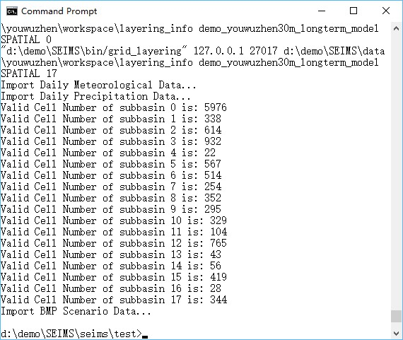
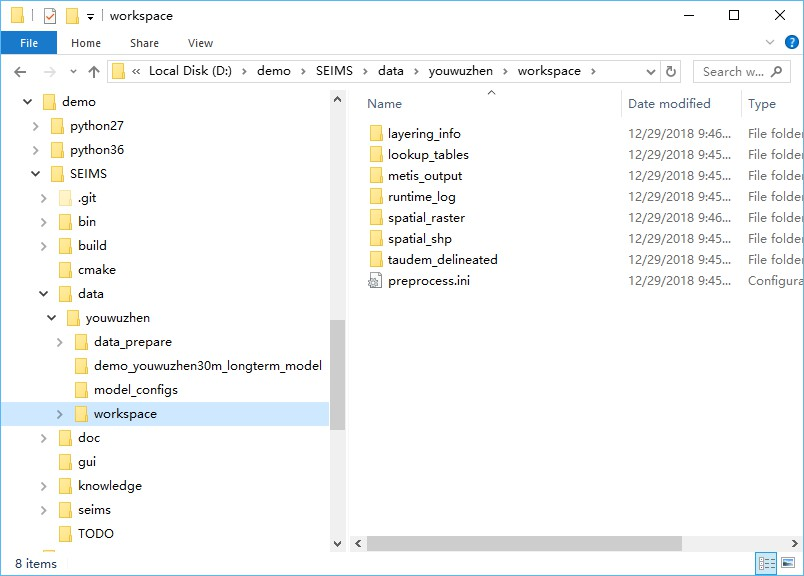
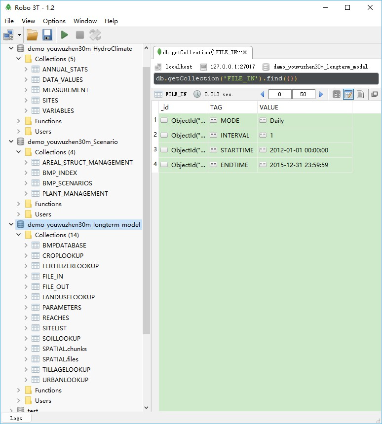

Data preprocessing for watershed modeling {#getstart_data_preprocessing}
===================================================================

[TOC]

Data preprocessing for watershed modeling is a workflow to extract spatial parameters from various spatial data (e.g., DEM, landuse, and soil map), organize plaintext data (e.g., precipitation and meteorological data, site-monitoring data, and BMP scenarios data), and import these data into MongoDB database of the study area.

**NOTE for Windows Users**:
Users should make sure all SEIMS executables (i.e., `*.exe` files) have been permitted to pass the firewall of Windows. Otherwise, you may encounter the **PermissionError**.
Copy `seims\Firewall_for_Windows.bat` to `bin` directory which contains all SEIMS executables. Then, right click the `bat` file and select to run as administrator.

# Simple usage
For simple usage, open a terminal (e.g., CMD on Window), enter the following commands to run the data preprocessing of the Youwuzhen watershed:
```
cd D:\demo\SEIMS\seims\test
D:
python demo_preprocess.py -name youwuzhen
```
The end of runtime logs of the data preprocessing was shown in Figure 1.

 

Figure 1 Runtime logs of data preprocessing for watershed modeling of the Youwuzhen watershed

After running the simple usage, the input configuration file for data preprocessing (`preprocess.ini`) is generated in the directory of intermediate data (i.e., `SEIMS\data\youwuzhen\workspace`, Figure 2) and the data for watershed modeling has been imported into MongoDB (Figure 3). The details of the configuration file, advanced usage, intermediate data, and watershed modeling databases will be introduced in the following sections. 

 

Figure 2 Directory tree of intermediate data of the Youwuzhen watershed after data preprocessing

 

Figure 3 Screenshot of the watershed modeling databases of the Youwuzhen watershed

# Configuration file of data preprocessing
The simple usage of the data preprocessing includes two steps such as generating the configuration file according to the local paths of SEIMS and executing data preprocessing by the advanced usage which will be introduced in the next section.

SEIMS takes the `INI` file as the format of configuration files. `INI` files are plain text files with a basic structure composed of sections and options (an option is a pair of property and value). Semicolons (`;`) or number sign (`#`) at the beginning of the line indicate a comment which will be ignored. The data preprocessing configuration content of Youwuzhen watershed is as follows:
```ini
[PATH]
PREPROC_SCRIPT_DIR = d:\demo\SEIMS\seims\preprocess
CPP_PROGRAM_DIR = d:\demo\SEIMS\bin
MPIEXEC_DIR = None
BASE_DATA_DIR = d:\demo\SEIMS\data\youwuzhen
CLIMATE_DATA_DIR = d:\demo\SEIMS\data\youwuzhen\data_prepare\climate
SPATIAL_DATA_DIR = d:\demo\SEIMS\data\youwuzhen\data_prepare\spatial
MEASUREMENT_DATA_DIR = d:\demo\SEIMS\data\youwuzhen\data_prepare\observed
BMP_DATA_DIR = d:\demo\SEIMS\data\youwuzhen\data_prepare\scenario
MODEL_DIR = d:\demo\SEIMS\data\youwuzhen\demo_youwuzhen30m_longterm_model
TXT_DB_DIR = d:\demo\SEIMS\data\youwuzhen\data_prepare\lookup
WORKING_DIR = d:\demo\SEIMS\data\youwuzhen\workspace
[MONGODB]
HOSTNAME = 127.0.0.1
PORT = 27017
ClimateDBName = demo_youwuzhen30m_HydroClimate
BMPScenarioDBName = demo_youwuzhen30m_Scenario
SpatialDBName = demo_youwuzhen30m_longterm_model
[CLIMATE]
HydroClimateVarFile = Variables.csv
MeteoSiteFile = Sites_M.csv
PrecSiteFile = Sites_P.csv
MeteoDataFile = meteo_daily.csv
PrecDataFile = pcp_daily.csv
thiessenIdField = ID
[SPATIAL]
dem = ywzdem30m.tif
outlet_file = outlet_beijing1954.shp
PrecSitesThiessen = thiessen_pcp.shp
MeteoSitesThiessen = thiessen_meteo.shp
landuseFile = ywzlanduse30m.tif
landcoverInitFile = landcover_initial_parameters.csv
soilSEQNFile = ywzsoil30m.tif
soilSEQNText = soil_properties_lookup.csv
field_partition_thresh = 15
[OPTIONAL_PARAMETERS]
D8AccThreshold = 35
np = 4
D8DownMethod = Surface
dorm_hr = -1.
T_base = 0.
imperviousPercInUrbanCell = 0.3
defaultLanduse = 33
defaultSoil = 201
```

The configuration file for data preprocessing, such as that of the Youwuzhen watershed, includes five sections, i.e., `PATH`, `MONGODB`, `CLIMATE`, `SPATIAL`, and `OPTIONAL_PARAMETERS`. 

Several property-value pairs (i.e., options) are included within each section. The names of sections and properties should not be changed. Note that section and property names are not case sensitive in the Windows implementation.

+ `PATH`: Full paths of executables, data, and intermediate workspace.

    1. `PREPROC_SCRIPT_DIR`: The path of Python scripts of data preprocessing.
    2. `CPP_PROGRAM_DIR`: The install directory of SEIMS C/C++ applications.
    3. `MPIEXEC_DIR`: The directory path of the MPI executable, i.e., `C:\Program Files\Microsoft MPI\Bin`. If it has been added to the environment path, the value can be `None` or commented.
    4. `BASE_DATA_DIR`: The base data directory of the study area.
    5. `CLIMATE_DATA_DIR`: (Optional) The path of climate data which include precipitation data (Section 2:2.3) and meteorological data (Section 2:2.4). If not specified (means the option line is commented), SEIMS will try to find climate data in `BASE_DATA_DIR\data_prepare\climate`.
    6. `SPATIAL_DATA_DIR`: (Optional) The path of spatial data (Section 2:2.1.1). If not specified, SEIMS will try to find spatial data in `BASE_DATA_DIR\data_prepare\spatial`.
    7. `MEASUREMENT_DATA_DIR`: (Optional) The path of observed data (Section 2:2.5). If not specified, SEIMS will try to find observed data in `BASE_DATA_DIR\data_prepare\observed`.
    8. `BMP_DATA_DIR`: (Optional) The path of BMP scenarios data (Section 2:2.7). If not specified, SEIMS will try to find scenario data in `BASE_DATA_DIR\data_prepare\scenario`.
    9. `MODEL_DIR`: The model path of the study area which includes several configuration files for the watershed modeling. For data preprocessing, the `file.in` and `file.out` are required, the calibrated parameters `param.cali` is optional. Details of the file structure of model folder will be introduced in Section 2:4.2.
    10. `TXT_DB_DIR`: (Optional) The path of additional lookup tables (Section 2:2.6). If not specified, SEIMS will try to find lookup tables in `BASE_DATA_DIR\data_prepare\lookup`.
    11. `WORKING_DIR`: (Optional) Workspace for intermediate data. If not specified, SEIMS will use the default path of `BASE_DATA_DIR\workspace`.

+ `MONGODB`: MongoDB related settings.

    1. `HOSTNAME`: IP address of MongoDB server, e.g., 127.0.0.1 (i.e., localhost).
    2. `PORT`: Port of MongoDB server, e.g., 27017 by the default. 
    3. `SpatialDBName`: Name of the main spatial database of the study area created in MongoDB server (Figure 2:3 3). The name **MUST** be the same with the folder name of `MODEL_DIR`.
    4. `ClimateDBName`: Name of the hydro-climate database created in MongoDB server (Figure 2:3 3).
    5. `BMPScenarioDBName`: Name of the BMP scenarios database created in MongoDB server (Figure 2:3 3).

+ `CLIMATE`: Filenames of climate data located in `CLIMATE_DATA_DIR`.

    1. `HydroClimateVarFile`: Types and Units of climate data variables (Section 2:2.4).
    2. `MeteoSiteFile`: The spatial information of meteorological station (Section 2:2.4).
    3. `PrecSiteFile`: The spatial information of precipitation station (Section 2:2.3.1)
    4. `MeteoDataFile`: The meteorological data (Section 2:2.4).
    5. `PrecDataFile`: The precipitation data (Section 2:2.3.2).
    6. `thiessenIdField`: (Optional) The field ID in the Thiessen polygon files of climate sites (Section 2:2.2), the default is `ID`.

+ `SPATIAL`: Filenames of spatial data located in SPATIAL_DATA_DIR and TXT_DB_DIR.

    1. `dem`: The original DEM data.
    2. `outlet_file`: (Optional) The outlet of the study area.
    3. `PrecSitesThiessen`: The Thiessen polygon file of precipitation stations.
    4. `MeteoSitesThiessen`: The Thiessen polygon file of meteorological stations.
    5. `landuseFile`: The raster file of landuse types.
    6. `landcoverInitFile`: The lookup table of initial landcover parameters (Section 2:2.6.2).
    7. `soilSEQNFile`: The raster file of soil sequences.
    8. `soilSEQNText`: The lookup table of soil properties (Section 2:2.6.1).
    9. `field_partition_thresh`: (Optional) Threshold values for the delineation of hydrologically connected fields (Wu et al., 2018). Multiple thresholds can be specified such as `10,15,20`. The partitioned fields named `fields_<threshold>.tif` (e.g., `fields_15.tif`) will be imported into the main spatial database (i.e., SpatialDBName). In the meantime, a json formatted file named `connected_field_units_updown_<threshold>.json` will be generated in the `MODEL_DIR`, which describes the upstream and downstream relationships of fields and landuse information, etc. The hydrologically connected fields can be used as BMP configuration units for BMP scenarios analysis (see Section 2:8).

+ `OPTIONAL_PARAMETERS`: Optional parameters.

    1. `D8AccThreshold`: Flow accumulation threshold for stream and subbasin delineation, the default is 0. In such circumstance, the determination of threshold will be performed by the drop analysis function of TauDEM automatically.
    2. `np`: Number of processes for MPI-based parallel computing of C++ applications, e.g., TauDEM functions. The default is 4.
    3. `D8DownMethod`: Calculation method of distance down to a stream, the available values are pythagoras, horizontal, vertical, and surface, or p, h, v, and s for simplification, respectively. The default is surface or s. More information can be referred to http://hydrology.usu.edu/taudem/taudem5/help53/DInfinityDistanceDown.html.
    4. `dorm_hr`: Day length threshold hours for dormancy, the default is -1.
    5. `T_base`: Base temperature (degC) for heat unit calculation, the default is 0.
    6. `imperviousPercInUrbanCell`: Impervious percent in urban units, the default is 0.3.
    7. `defaultLanduse`: The default landuse type for NoData area which **MUST** exist in the prepared `landcoverInitFile`.
    8. `defaultSoil`: The default soil sequence type for NoData area which **MUST** exist in the prepared `soilSEQNFile`.

# Advanced usage
The Python scripts of data preprocessing are in `SEIMS/seims/preprocess`. The prefix of script names are distinguished by functionality, i.e., `sd_` for the spatial discretization of watershed (e.g., the delineation of subbasins), `sp_` for the extraction of spatial parameters (e.g., landuse and soil related parameters according to the database of SWAT model and additional lookup tables, Section 2:2.6), `hydro_` for the data processing of hydrology and climate data, and `db_` for the input and/or output of MongoDB database. The `main.py` is the entrance for the entire workflow of data preprocessing. Each script can be executed independently though the unified format:
`python <script_name> -ini </path/to/configuration-file>`.
For example, to run the entire workflow:
```python
cd D:\demo\SEIMS\seims\preprocess
python main.py -ini D:\demo\SEIMS\data\youwuzhen\workspace\preprocess.ini
```

If the BMP scenarios related data needs to be updated, there is only needed to run the script of importing BMP scenarios data into MongoDB:
```python
cd D:\demo\SEIMS\seims\preprocess
python db_import_bmpscenario.py -ini D:\demo\SEIMS\data\youwuzhen\workspace\preprocess.ini
```

The entire workflow of preprocessing can be conducted in two main steps, i.e., the spatial discretization of watershed (i.e., `sd_delineation.py`) and the creation of MongoDB database (i.e., `db_build_mongodb.py`). Users are highly recommended to execute `sd_delineation.py` with the `D8AccThreshold` set to 0 first to get a preliminary delineation of subbasins. The automatically delineated subbasin may too fine to get a proper spatial scale for watershed modeling. Therefore, users may want to adjust the proper threshold manually according to the flow accumulated raster (i.e., `SEIMS\data\youwuzhen\workspace\taudem_delineated\accTauD8WithWeight.tif`, more information about the intermediate data will be described in the following section). After a final threshold is determined and the value of `D8AccThreshold` in the configuration file updated, the `main.py` should be reran for the entire preprocessing.

Note that the present implementation of data preprocessing tools is to support the currently available SEIMS modules of watershed processes. That means, if the input data of a newly developed module is not available from the database or outputs of other modules, the corresponding preprocessing tools should be added. For more information, please referred to the “Section 4:1 Develop a new module of one watershed process”.

# Intermediate data of preprocessing
As is shown in Figure 2, the intermediate data of data preprocessing are organized into seven folders.

+ `taudem_delineated`: The original results and intermediate data of spatial delineation of subbasins based on TauDEM such as the flow accumulation data (`accTauD8WithWeight.tif`), the delineated subbasin data (`subbasinTauM.tif`), and the D8 flow direction masked by subbasinTauM.tif (`flowDirTauM.tif`), etc. 
+ `lookup_tables`: Lookup tables of landuse database based on the SWAT model used for generating landuse type related parameters.
    > TODO: In the current version of SEIMS, landuse and soil type related spatial parameters (raster data) are prepared and imported into MongoDB separately as single files (i.e., GridFS in MongoDB). This solution will lead to the low performance of reading data of SEIMS main program. Therefore, in the future version, lookup tables should be used instead of separated raster- or array-based parameters.
+ `spatial_raster`: All spatial parameters (raster data) masked by the delineated watershed boundary (i.e., `subbasinTauM.tif`).
+ `spatial_shp`: Spatial vector data for the whole watershed and each subbasin, e.g., `reach_<N>.shp` (`N` represents the subbasin number starts from 1, while `reach.shp` is for the whole watershed), `subbasin_<N>.shp`, `basin.shp`, and `outlet.shp`.
+ `layering_info`: The flow in and out indexes of each basic simulation units (e.g., gridded cells and irregularly shaped fields), and the routing layers of `UPDOWN` (default, layering from source) and `DOWNUP` (layering from outlet) methods based on flow direction algorithms.
+ `metis_output`: Groups partitioned by `METIS` software for static task scheduling of MPI-based parallel computing at subbasin levels. For example, the results of `metis.part.4` located in `SEIMS\data\youwuzhen\workspace\metis_output\kmetis` is `3 0 2 1 1 3 1 3 2 0 2 0 2 1 1 1 3`, which means that the 17 subbasins of the Youwuzhen watershed will be distributed on four processes, i.e., subbasin IDs of (2, 10, 12), (4, 5, 7, 14, 15, 16), (3, 9, 11, 13), and (1, 6, 8, 17).
+ `runtime_log`: Runtime logs (with prefix of `status_`) and several input configuration files of SEIMS C++ applications (with prefix of `config_`).

# Structure of the watershed modeling database
The screenshot of the structure of the watershed modeling database was shown in Figure 2:3 3. Three databases were created with the specific names in the configuration `INI` file of data preprocessing (Section 2:3.2). The preprocessed data were organized as different collections (or referred to as tables) within database.
+ `demo_youwuzhen30m_longterm_model`: Main spatial database of the study area
    1. Model configuration collections, such as `FILE_IN` and `FILE_OUT`.
    2. Initial model parameters including calibration information, i.e., `PARAMETERS`.
    3. Reach related parameters, i.e., `REACHES`, including geometric parameters, default chemical parameters, and subbasin groups for task scheduling of MPI-based parallel computing, etc.
    4. Climate station information for each subbasin with the corresponding HydroClimate database name, i.e., `SITELIST`.
    5. BMP scenario database name, i.e., `BMPDATABASE`.
    6. Spatial parameters, i.e., `SPATIAL`.
    7. Lookup tables, i.e., `CROPLOOKUP`, `FERTILIZERLOOKUP`, `LANDUSELOOKUP`, `SOILLOOKUP`, `TILLAGELOOKUP`, and `URBANLOOKUP`.

+ `demo_youwuzhen30m_HydroClimate`: Hydro-climate database

    1. Climate and hydrology stations, i.e., `SITES`.
    2. Climate data (`DATA_VALUES`) and hydrologic monitoring data (`MEASUREMENT`).
    3. Annual statistics of climate data, i.e., `ANNUAL_STATS`.
    4. Types and units of hydro-climate variables, i.e., `VARIABLES`.

+ `demo_youwuzhen30m_Scenario`: BMPs scenario database

    1. BMP IDs, i.e., `BMP_INDEX`.
    2. BMP scenarios, i.e., `BMP_SCENARIOS`.
    3. Various BMPs parameters, the collection names are dependent on the plain text filename located in management practices data (e.g., `SEIMS\data\youwuzhen\data_prepare\scenario`), such as `PLANT_MANAGEMENT` and `AREAL_STRUCT_MANAGEMENT` in this demo study.

# See more...
Also see introduction of the Python package @subpage intro_preprocess_pkg

AutoFuzSlpPos Python package: @subpage intro_autofuzslppos_pkg

Predefined database: @subpage intro_predefined_database