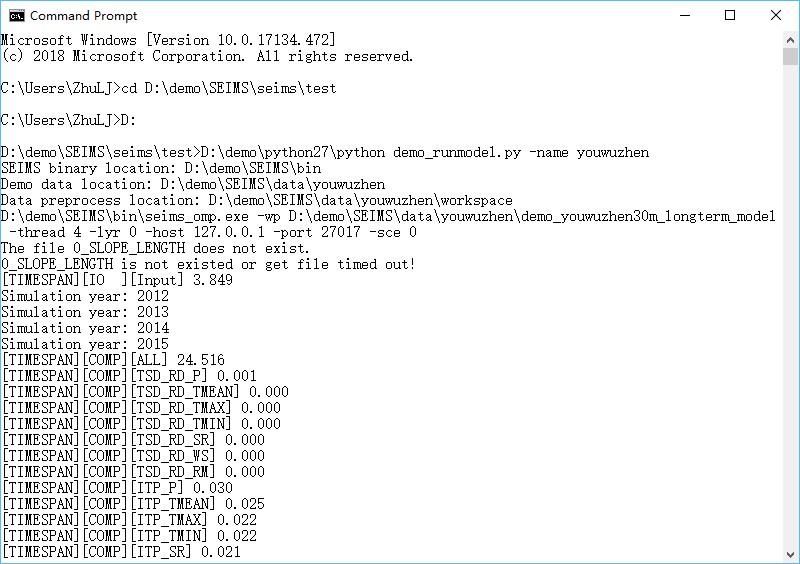
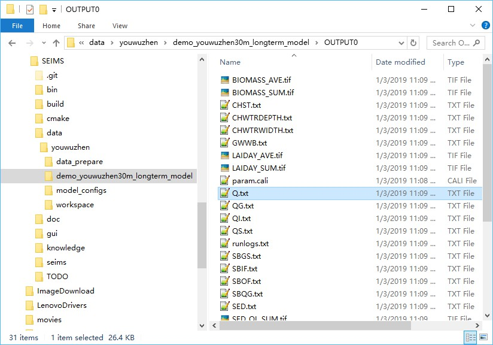

Running a SEIMS-based waterhsed model {#getstart_run_seims_model}
============================================================

[TOC]

# Simple usage
For simple usage, open a terminal (e.g., CMD on Window), enter the following commands to execute the predefined SEIMS-based watershed model of the Youwuzhen watershed (hereafter referred to as the Youwuzhen watershed model):
```python
cd D:\demo\SEIMS\seims\test
D:
python demo_runmodel.py –name youwuzhen
```

The simulation will be finished in about 28 seconds (Figure 1). The predefined output information can be found in the model folder (i.e., `MODEL_DIR\OUTPUT0`), such as Figure 2.

 

Figure 1 Simple usage of the OpenMP version of the Youwuzhen watershed model

  

Figure 2 Predefined outputs of the Youwuzhen watershed model

# File structure of a SEIMS-based model
In simple terms, a SEIMS-based watershed model is a folder (e.g., `SEIMS\data\youwuzhen\demo_youwuzhen30m_longterm_model`) which consists of several SEIMS configuration files such as `file.in`, `file.out`, `param.cali`, and `config.fig`.

The `file.in` and `file.out` for basic model configuration are required, while `param.cali` for calibrated model parameters is optional. ~~These three plain text files will be read and imported into the main spatial database during data preprocessing (Section 2:3.2)~~. The MongoDB also can be updated by only running a single preprocessing Python script (i.e., `SEIMS\seims\preprocess\db_import_model_parameters.py`) when these files are changed such as during the manual calibration.

The `config.fig` file, the most important configuration file for constructing a SEIMS-based watershed model, is responsible for selecting SEIMS modules to participate in the watershed simulation, as well as specifying the simulation order of SEIMS modules.

## file.in
The `file.in` file is designed to define the simulation mode with time-step and the simulation period. Different from the plain text format described in [here](@ref dataprep_basic_plaintest), the basic format is `[TAG]|[VALUE]`. Currently, there are four required `TAG`s which must appear in this file.
+ `MODE`: A string that indicates a long-term or storm event simulation. The string here can only be `Daily` or `Storm` (case insensitive).
+ `INTERVAL`: An integer to specify the time-step (or the so-called temporal resolution) of simulation according to the simulation `MODE`. For long-term simulation, the unit is day, e.g., `INTERVAL|1` means the time-step is one day. For storm event simulation, the unit is second, e.g., `INTERVAL|3600` means the time-step is one hour. 
    
    Specifically, two different time-steps can be assigned for storm event simulation considering the differences between hillslope scale processes and channel scale process. For example, `INTERVAL|60,3600` means that the time-step for hillslope scale processes is one minute and one hour for channel scale processes.
+ `STARTTIME`: Starting date time of simulation with the format of `YYYY-MM-DD HH:MM:SS`
+ `ENDTIME`: Ending date time of simulation with the format of `YYYY-MM-DD HH:MM:SS`

For the Youwuzhen watershed model, which performs a long-term simulation with a time-step of one day and runs from Jan 1, 2012, to Dec 31, 2015, the content of `file.in` file is as follows.

```
MODE|Daily
INTERVAL|1
STARTTIME|2012-01-01 00:00:00
ENDTIME|2015-12-31 23:59:59
```

## file.out
The `file.out` file is designed to define the outputs of a SEIMS-based watershed model. The format follows the plain text format described in [here](@ref dataprep_basic_plaintest). Each line is corresponding to one output variable. The available fields of each line are listed in Table 1. 

Table 1 Available fields of `file.out` configuration file

|      Field name     |      Datatype     |      Description     |
|---|---|---|
|     OUTPUTID    |     String    |     Unique output identifier, e.g., QRECH for the streamflow at reach outlet.    |
|     TYPE    |     String    |     Data aggregation type for spatial data outputs, i.e., SUM, AVE, MAX, and MIN. Multiple types should be   concatenated by En dash. For example, SUM-AVE means output the sum and average   simultaneously. For time-series outputs, the TYPE can be NONE.    |
|     STARTTIME    |     Datetime string    |     Starting date time for the current output with the format of YYYY-MM-DD HH:MM:SS    |
|     ENDTIME    |     Datetime string    |     Ending date time for the current output with the format of YYYY-MM-DD HH:MM:SS    |
|     INTERVAL    |     Integer    |     Time-step for output. The default is -9999, which means the same time-step with the   simulation will be used.    |
|     INTERVAL_UNIT    |     String    |     Unit for INTERVAL, can be DAY and SEC. The default is -9999, which means the same with the   simulation.    |
|     FILENAME    |     String    |     Output filename with suffix, e.g., Q.txt and PET.tif.    |
|     SUBBASIN    |     String or Integer    |     Selected subbasins for output, can be ALL, OUTLET, or the subbasin IDs   concatenated with En dash, e.g., 1-4-5.    |

Among these fields, only the `OUTPUTID` is required. The values of missed fields will adopt the default values defined in the available output database which can be extended by users, i.e., `SEIMS\seims\preprocess\database\AvailableOutputs.csv`. So, users can specify the outputs of `QRECH` (Streamflow at reach outlet of each time step, m3/s) and `PET` (Potential evapotranspiration, mm) by simply specifying the output IDs, e.g.,
```
OUTPUTID
QRECH
PET
```
or specifying more detail information, e.g.,

```
OUTPUTID,TYPE,STARTTIME,ENDTIME,INTERVAL,INTERVAL_UNIT,SUBBASIN
QRECH,NONE,2012-01-01 00:00:00,2015-12-31 23:59:59,1,DAY,OUTLET
PET,SUM-AVE,2012-01-01 00:00:00,2015-12-31 23:59:59,-9999,-9999,ALL
```

## param.cali
The `param.cali` file is designed to define calibrated parameters. The absent of this file or a blank file is allowed and indicates the model will be executed with default parameter values. The format MUST be `NAME`, `IMPACT`, and `CHANGE`, while `CHANGE` is optional, and no header line is allowed. The `NAME` MUST be one of the predefined list of parameters which can be extended by users, i.e., `SEIMS\seims\preprocess\database\model_param_ini.csv`. The `CHANGE` means the type of impact on the parameter, which can be `RC` (relative change) or `AC` (absolute change). The `IMPACT` is a float value of change, for `RC`, the new parameter value will be `initial_value * impact`, while for `AC` it is `initial_value + impact`. 

Thus, three styles are accepted in `param.cali` file, such as:

```
Runoff_co,1.5
gw0,-50,
K_pet,-0.3,AC
```

Note that the script `db_import_model_parameters.py` should be executed once you have modified the `param.cali` file.


## config.fig
The `config.fig` file is designed to define SEIMS modules used in a SEIMS-based watershed model. **The sequences of these modules will be the execution order during simulation.** The basic order of SEIMS modules should be driver factors (i.e., climate data) related modules, modules of hillslope processes, and modules of channel and groundwater routing processes, such as the `config.fig` content of the Youwuzhen watershed model in Figure 2:4 3. More details about the selected modules of the Youwuzhen watershed model can be found in Qin et al. (2018).

```
01 ### Driver factors, including meteorological data and precipitation
02 0 | TimeSeries | | TSD_RD
03 0 | Interpolation_0 | Thiessen | ITP
04 ### Surface processes
05 0 | Soil temperature | Finn Plauborg | STP_FP
06 0 | PET | PenmanMonteith | PET_PM
07 0 | Interception | Maximum Canopy Storage | PI_MCS
08 0 | Snow melt | Snowpeak Daily | SNO_SP
09 0 | Infiltration | Modified rational | SUR_MR
10 0 | Depression and Surface Runoff | Linsley | DEP_LINSLEY
11 0 | Hillslope erosion | MUSLE | SERO_MUSLE
12 0 | Plant Management Operation | SWAT | PLTMGT_SWAT
13 0 | Percolation | Storage routing | PER_STR
14 0 | Subsurface | Darcy and Kinematic | SSR_DA
15 0 | SET | Linearly Method from WetSpa | SET_LM
16 0 | PG | Simplified EPIC | PG_EPIC
17 0 | ATMDEP | Atomosphere deposition | ATMDEP
18 0 | NUTR_TF | Nutrient Transformation of C, N, and P | NUTR_TF
19 0 | Water overland routing | IUH | IUH_OL
20 0 | Sediment overland routing | IUH | IUH_SED_OL
21 0 | Nutrient | Attached nutrient loss | NUTRSED
22 0 | Nutrient | Soluble nutrient loss | NUTRMV
23 0 | Pothole | SWAT cone shape | IMP_SWAT
24 0 | Soil water | Water balance | SOL_WB
25 ### Route Modules, including water, sediment, and nutrient
26 0 | Groundwater | Linear reservoir | GWA_RE
27 0 | Nutrient | groundwater nutrient transport | NUTRGW
28 0 | Water channel routing | MUSK | MUSK_CH
29 0 | Sediment channel routing | Simplified Bagnold equation | SEDR_SBAGNOLD
30 0 | Nutrient | Channel routing | NutrCH_QUAL2E
```

As shown above, different from the plain text format described in [here](@ref dataprep_basic_plaintest), the basic format for each selected SEIMS module is `[MODULE NO.]|[PROCESS NAME]|[METHOD NAME]|[MODULE ID]`, in which,
+ `MODULE NO.` could be any number
+ `PROCESS NAME` is the name of the corresponding watershed process
+ `METHOD NAME` is the name of the algorithm to simulate the watershed process
+ `MODULE ID` is the ID of the SEIMS module, i.e., the file name of the corresponding dynamic library (`dll`, `so`, or `dylib`) file. If the module cannot be located or loaded, SEIMS will exit and report an error.

SEIMS main program only uses the `PROCESS NAME` and `MODULE ID`, while the `MODULE NO.` and `METHOD NAME` are just designed for readability. The `MODULE ID` should match exactly with the ID of SEIMS module. The `PROCESS NAME` may contain extra configuration information for some modules.

+ For interpolation modules, the vertical interpolation method (0 means do not perform vertical interpolation based on lapse rate, while 1 means do) must be specified as suffix of the `PROCESS NAME`, e.g.,
`0 | Interpolation_1 | Thiessen | ITP`

    > TODO: In the current version of SEIMS, the lapse rate of precipitation and temperature are defined as constants, i.e., 0.03 mm/100 m for precipitation and -0.65 degC/100 m for temperature. In the future development, the lapse rate of various meteorological variables should be allowed as inputs according to the study area.

# Advanced usage
The SEIMS main programs include an OpenMP version (i.e., `seims_omp`) and a version which is a hybrid of OpenMP and MPI (hereafter referred to as MPI&OpenMP version, i.e., `seims_mpi`). In the OpenMP version, parallel computing is conducted at the basic-unit level (e.g., gridded cells or irregularly shaped fields) in each module based on OpenMP. In the MPI&OpenMP version, the watershed is first decomposed into subbasins, and MPI-based parallel computation is conducted at the subbasin level. And then within each subbasin, same as the OpenMP version, OpenMP-based parallel computation is conducted at the basic-unit level.

> Note: If OpenMP is not supported by the C/C++ compiler, the OpenMP-based parallel computing will not take affect and the executable name of SEIMS main program will be `seims`.

## Run with command line interface
The Command Line Interface (CLI) is the recommended way to run SEIMS-based watershed model. The invoking commands are slightly different between the OpenMP version and MPI&OpenMP version.
### OpenMP version
The complete and recommended usage of the OpenMP version of SEIMS main program is as follows.

```shell
seims_omp -wp <modelPath> [-thread <threadsNum> -lyr <layeringMethod> -host <hostname> -port <port> -sce <scenarioID> -cali <calibrationID> -id <subbasinID>]
```

In which,
1.	`modelPath` is the path of the SEIMS-based watershed model (see `MODEL_DIR` in the configuration file of data preprocessing, Section 2:3.2).
2.	`threadsNum` (Optional) is the number of threads used for OpenMP-based parallel computing, which must be greater or equal than 1 (default).
3.	`layeringMethod` (Optional) can be 0 and 1, which means the routing layering method based on flow direction algorithms of `UPDOWN` (default, layering from source) and `DOWNUP` (layering from outlet), respectively.
4.	`hostname` is the IP address of MongoDB server. The default is `127.0.0.1` (i.e., `localhost`).
5.	`port` is the port number of MongoDB server, and the default is 27017.
6.	`scenarioID` is the ID of BMP scenario which has been defined in the `BMP_SCENARIOS` collection of Scenario database. By default, the scenarioID is -1, which means no scenario will be applied.
7.	`calibrationID` is the ID (i.e., index) of calibration data which has been defined in `PARAMETERS` collection of the main database. By default, the `calibrationID` is -1, which means no calibration will be applied.
8.	`subbasinID` is the subbasin that will be executed. 0 means the whole watershed. 9999 is reserved for Field version.
9.  todo for more available arguments.

For the Youwuzhen watershed, one of the complete usages is like:

```bat
 cd D:\demo\SEIMS\bin
 D:
 seims_omp -wp D:\demo\SEIMS\data\youwuzhen\demo_youwuzhen30m_longterm_model -thread 4 -lyr 1 -host 127.0.0.1 -port 27017 -sce 0
```

The runtime logs of the OpenMP version were shown in Figure 2:4 1, in which the time-consuming of data Input/Output (IO), computation of each module, and entire simulation were shown. 

The output folder was created in the model directory with the folder name followed a naming format of `OUTPUT<_MPI>-<FlowDir>-<LayerMethod>-<scenarioID>-<calibrationID>`.

### MPI&OpenMP version
The MPI&OpenMP version of SEIMS main program has the same arguments with the OpenMP version but the different way of invoking it (Figure 3:1 1). The basic format to run a MPI program is:

```shell
mpiexec -<hostsopt> <hostfile> -n <processNum> seims_mpi -wp <modelPath> [-thread <threadsNum> -lyr <layeringMethod> -host <hostname> -port <port> -sce <scenarioID> -cali <calibrationID> -id <subbasinID>]
```

In which,
1. `hostopt` (Optional) is the identifier of the input argument of MPI to specify a host list file which is various with different MPI implementations, e.g., `-machinefile` or `-hostfile`.
2. `hostfile` (Optional) is the host list file which may be different with MPI implementation. For example, OpenMPI takes the format like:
    ```
    b10n08.cluster.com slots=3 max-slots=3
    b08n01.cluster.com slots=4 max-slots=4
    b10n05.cluster.com slots=4 max-slots=4
    ```
    and IntelMPI uses:
    ```
    b10n08.cluster.com 3
    b08n01.cluster.com 4
    b10n05.cluster.com 4
    ```
3. `processNum` (Optional) is the number of processes.

For the Youwuzhen watershed, one of the complete usages for the MPI&OpenMP version on Windows platform is like:

```bat
 cd D:\demo\SEIMS\bin
 D:
 mpiexec -n 4 seims_mpi -wp D:\demo\SEIMS\data\youwuzhen\demo_youwuzhen30m_longterm_model -thread 1 -lyr 1 -host 127.0.0.1 -port 27017 -sce 0
```

The corresponding runtime output logs was shown in Figure 2:4 5. Different from the output information of the OpenMP version (Figure 2:4 1), the maximum (`[TIMESPAN][MAX]`), minimum (`[TIMESPAN][MIN]`), and average (`[TIMESPAN][AVG]`) time-consuming of data IO, computation of all modules, and entire simulation derived from each process (i.e., four processes of MPI in this example) are given. The maximum time-consuming is the most used statistics for the evaluation of parallel performance.

## Run with Python
Except for the CLI way, SEIMS also provides a configuration file based method to execute model with Python. Same with the simple usage of data preprocessing (2:3.2), a configuration file was also generated according to the local paths of SEIMS during the simple usage of running the Youwuzhen watershed model, such as `SEIMS\data\youwuzhen\workspace\runmodel.ini` (Figure 2:4 7).

The configuration file of running SEIMS-based watershed model, such as that of the Youwuzhen watershed model shown in Figure 2:4 7, includes several options within one section (i.e., `SEIMS_Model`) to specify the arguments of SEIMS main programs introduced in previous sections. The full list of the arguments are as follows.

+ `SEIMS_Model`: 
    1. `MODEL_DIR`: The model path of the study area which includes several configuration files for the watershed modeling.
    2. `BIN_DIR`: The path of SEIMS modules and main programs, which is the same with `CPP_PROGRAM_DIR` defined in the configuration file of data preprocessing (i.e., the `preprocess.ini`; see Section 2:3.2) by default.
    3. `HOSTNAME`: IP address of MongoDB server, e.g., `127.0.0.1` (i.e., `localhost`).
    4. `PORT`: Port of MongoDB server, e.g., 27017 by the default. 
    5. `VERSION`: (Optional) Version of SEIMS main program which can be `OMP` and `MPI` for OpenMP version and MPI&OpenMP version, respectively. The default is `OMP`.
    6. `MPI_BIN`: (Optional) Full path of the executable of MPI, e.g., `C:\Program Files\Microsoft MPI\Bin\mpiexec.exe`.
    7. `hostopt`: (Optional) The identifier of the input argument of MPI to specify a host list file which is various with different MPI implementations, e.g., `-machinefile` or `-hostfile`.
    `hostfile`: (Optional) The host list file which may be different with MPI implementation.
    8. `processNum`: (Optional) The number of processes, the default is 1.
    9. `threadsNum`: (Optional) The number of threads per process, the default is 4.
    10. `layeringMethod`: (Optional) Routing layering method based on flow direction algorithms, can be 0 or 1.
    11. `scenarioID`: (Optional) The ID of BMP scenario.
    12. `calibrationID`: (Optional) The ID (i.e., index) of calibration data.
    13. `subbasinID`: (Optional) The ID of subbasin, 0 for the whole watershed and 9999 is reserved for Field version.
    14. `Sim_Time_start`: (Optional) Starting date time of simulation with the format of `YYYY-MM-DD HH:MM:SS`.
    15. `Sim_Time_end`: (Optional) Ending date time of simulation with the format of `YYYY-MM-DD HH:MM:SS`. If not specified, the starting and ending date time prepared in database (i.e., `FILE_IN` collection) will be applied.
    16. `Output_Time_start`: (Optional) Starting date time of output items with the format of `YYYY-MM-DD HH:MM:SS`.
    17. `Output_Time_end`: (Optional) Ending date time of output items with the format of `YYYY-MM-DD HH:MM:SS`. If specified, the time period of all selected output IDs in `FILE_OUT` collection will be updated and applied.

```
[SEIMS_Model]
MODEL_DIR = D:\demo\SEIMS\data\youwuzhen\demo_youwuzhen30m_longterm_model
BIN_DIR = D:\demo\SEIMS\bin
HOSTNAME = 127.0.0.1
PORT = 27017
version = OMP
mpi_bin = mpiexec
# hostopt = ...
# hostfile = ...
processNum = 2
threadsNum = 4
layeringMethod = 1
scenarioID = 0
calibrationID = -1
subbasinID = 0
# Simulation period (UTCTIME)
Sim_Time_start = 2012-01-01 00:00:00
Sim_Time_end = 2015-12-31 23:59:59
# Time period of ALL selected outputs
Output_Time_start = 2012-01-01 00:00:00
Output_Time_end = 2015-12-31 00:00:00
```

To run the SEIMS-based watershed model defined by the configuration file described above, please follow the unified format of running SEIMS Python scripts, e.g.,

```python
cd D:\demo\SEIMS\seims
python run_seims.py -ini D:\demo\SEIMS\data\youwuzhen\workspace\runmodel.ini
```

## Customize the demo Youwuzhen watershed model
To demonstrate the ability of SEIMS to construct different watershed models, a simple change is made to the Youwuzhen watershed model, i.e., replacing the Penman-Monteith method (`PET_PM`) to the Priestley-Taylor method (`PET_PT`) for the simulation of potential evapotranspiration. Note that, except for the potential evapotranspiration, the `PET_PM` module also simulates the potential plant transpiration while the `PET_PT` not, thus the module named AET_PTH is added for the simulation of potential plant transpiration and potential and actual soil evaporation. Meanwhile, the soil evaporation module (`SET_LM`) is no longer need. The newly customized Youwuzhen watershed model (i.e., the `config.fig` file) is as follows:

```
01 ### Driver factors, including climate and precipitation
02 0 | TimeSeries | | TSD_RD
03 0 | Interpolation_0 | Thiessen | ITP
04 ### Surface processes
05 0 | Soil temperature | Finn Plauborg | STP_FP
06 0 | PET | PriestleyTaylor | PET_PT
07 #0 | PET | PenmanMonteith | PET_PM
08 0 | Interception | Maximum Canopy Storage | PI_MCS
09 0 | Snow melt | Snowpeak Daily | SNO_SP
10 0 | Infiltration | Modified rational | SUR_MR
11 0 | Depression and Surface Runoff | Linsley | DEP_LINSLEY
12 0 | Hillslope erosion | MUSLE | SERO_MUSLE
13 0 | Plant Management Operation | SWAT | PLTMGT_SWAT
14 0 | Percolation | Storage routing | PER_STR
15 0 | Subsurface | Darcy and Kinematic | SSR_DA
16 0 | AET | Hargreaves and PriestleyTaylor | AET_PTH
17 #0 | SET | Linearly Method from WetSpa | SET_LM
18 0 | PG | Simplified EPIC | PG_EPIC
19 0 | ATMDEP | Atomosphere deposition | ATMDEP
20 0 | NUTR_TF | Nutrient Transformation of C, N, and P | NUTR_TF
21 0 | Water overland routing | IUH | IUH_OL
22 0 | Sediment overland routing | IUH | IUH_SED_OL
23 0 | Nutrient | Attached nutrient loss | NUTRSED
24 0 | Nutrient | Soluble nutrient loss | NUTRMV
25 0 | Pothole | SWAT cone shape | IMP_SWAT
26 0 | Soil water | Water balance | SOL_WB
27 ### Route Modules, including water, sediment, and nutrient
28 0 | Groundwater | Linear reservoir | GWA_RE
29 0 | Nutrient | groundwater nutrient transport | NUTRGW
30 0 | Water channel routing | MUSK | MUSK_CH
31 0 | Sediment channel routing | Simplified Bagnold equation | SEDR_SBAGNOLD
32 0 | Nutrient | Channel routing | NutrCH_QUAL2E
```

With all model parameters remain the default values, the demo Youwuzhen watershed model and the new customized model were executed respectively. Figure 2:4 9 showed the spatial distributions of average potential evapotranspiration simulated by the Penman-Monteith method (Figure 2:4 9a) and Priestley-Taylor method (Figure 2:4 9b), which have a very similar spatial pattern but different values. The differences of the simulated potential evapotranspiration can also be reflected in the simulated streamflow at the watershed outlet (Figure 2:4 10).
