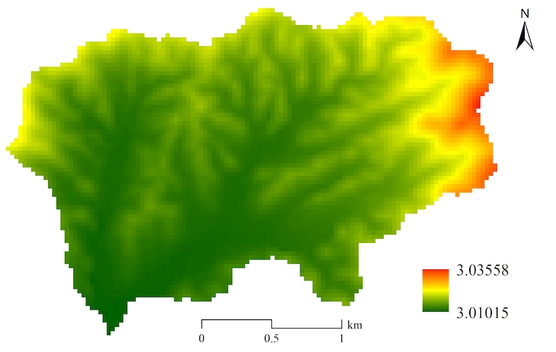
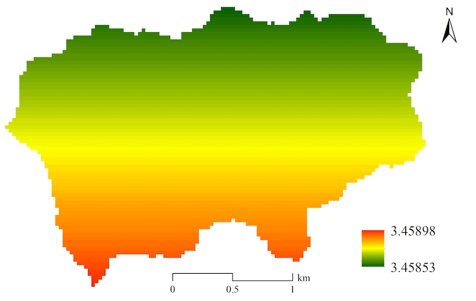

Develop a new module of one watershed process {#dev_new_module}
===================================================================

[TOC]

Generally, it requires three main steps to develop a new module for a specific watershed subprocess based on the SEIMS module interfaces.
+ Review the related literature and/or source code (if available) of the watershed subprocess algorithm and figure out the input and output parameters of the algorithm as well as the specific simulation formula (or the execution code).
+ Create new SEIMS module based on the module template and `CMake` structure.
+ Open the SEIMS solution in Visual Studio or other IDEs and start to code following the recommended order of APIs.

In this section, the simulation of potential evapotranspiration using Hargreaves method was selected as an example to demonstrate these steps.

# Review literature and/or existing model code
Evapotranspiration is a collective term that includes all processes by which water at the earth’s surface is converted to water vapor (Neitsch *et al.*, 2011). It includes evaporation from the plant canopy, transpiration, sublimation, and evaporation from the soil. An accurate estimation of evapotranspiration is critical in the assessment of water resources and the impact of climate and land use change on those resources.

The Hargreaves method was originally derived from eight years of cool-season Alta fescue grass lysimeter data from Davis, California (Hargreaves, 1975). The Hargreaves method was implemented in the SWAT model with the improved equation (Hargreaves, 1985):

$$\lambda E_{o} = petco\cdot H_{0}\cdot \left (T_{max} - T_{min} \right ) ^{0.5} \cdot \left (T_{avg} + 17.8 \right )$$
	  	
where *λ* is the latent heat of vaporization (MJ kg<sup>-1</sup>), *E*<sub>o</sub> is the potential evapotranspiration (mm d<sup>-1</sup>), *petco* is coefficient related to radiation which ranges from 0.0019 to 0.0032, *H*<sub>0</sub> is the extraterrestrial radiation (MJ m<sup>-2</sup> d<sup>-1</sup>), *T*<sub>max</sub>, *T*<sub>min</sub>, and *T*<sub>avg</sub> are the maximum, minimum, and average air temperature for a given day (°C), respectively.

The source code of the Hargreaves method for potential evapotranspiration can be found in `etpot.f`. The following code snippet showed the core simulation code.

```fortran
        case (2)   !! HARGREAVES POTENTIAL EVAPOTRANSPIRATION METHOD
 
         !! extraterrestrial radiation
         !! 37.59 is coefficient in equation 2.2.6 !!extraterrestrial
         !! 30.00 is coefficient in equation 2.2.7 !!max at surface
         ramm = 0.
         ramm = hru_rmx(j) * 37.59 / 30. 
 
         if (tmx(j) > tmn(j)) then
           pet_day = harg_petco(hru_sub(j))*(ramm / xl)*(tmpav(j) + 17.8)*
      &                                            (tmx(j) - tmn(j))**0.5
           pet_day = Max(0., pet_day)
         else
           pet_day = 0.
         endif
```

where `ramn` is the extraterrestrial radiation which is calculated by maximum possible radiation for the day (`hru_rmx`), `hru_rmx` is a function of day of year and latitude, `xl` is the latent heat of vaporization which is calculated by the mean air temperature (`tmpav`).

The source code of the calculation of `hru_rmx` can be found in `clgen.f`.

To sum up, the simulation of potential evapotranspiration using the Hargreaves method requires the coefficient related to radiation, latitude, maximum temperature, minimum temperature, and average temperature. The simulation code can be rewritten from the FORTRAN source code of SWAT (i.e., `etpot.f` and `clgen.f`).

# Create new SEIMS module
As introduced in previous sections, the source code of SEIMS library is in `SEIMS/seims/src/seims_main/modules`. For the convenience of management, SEIMS modules are divided into several categories. There is one `CMakeLists.txt` file to indicate which categories are involved in the SEIMS project, i.e., `SEIMS/seims/src/seims_main/modules/CMakeLists.txt`.

```
MESSAGE(STATUS "      Compiling SEIMS_subdir: modules...")
ADD_SUBDIRECTORY(./climate)
ADD_SUBDIRECTORY(./hydrology)
ADD_SUBDIRECTORY(./hydrology_longterm)
ADD_SUBDIRECTORY(./erosion)
ADD_SUBDIRECTORY(./nutrient)
ADD_SUBDIRECTORY(./ecology)
ADD_SUBDIRECTORY(./management)
ADD_SUBDIRECTORY(./test)
```

It is worth to note that a corresponding line with the `ADD_SUBDIRECTORY()` command should be appended if a new category is added.

The template of the SEIMS module is the template folder located in `SEIMS/seims/src/seims_main/modules/test`, which contains four files, i.e., `CMakeLists.txt`, `api.cpp`, `template.h`, and `template.cpp`.

1. `CMakeLists.txt`: file used to create the project for building the module executable library.
2. `api.cpp`: implementation file of `MetadataInformation` function.
3. `template.h`: header file that defines the module class which is inherited from the basic class of SEIMS module (i.e., `SimulationModule`). The header file should be renamed with a meaningful name, such as `PETHargreaves.h`.
4. `template.cpp`: implementation file that includes `SetData` and `GetData` functions `CheckInputData` and `InitialOutputs` functions, and Execute function. The implementation file should be renamed with the same filename of the header file, such as `PETHargreaves.cpp`.

Please follow these steps to create a new SEIMS module based on the module template.

1. Copy the folder of the SEIMS module template to an existing or newly created directory of SEIMS module library, e.g., `modules/hydrology_longterm`, and rename with the new module name followed the format of <SubprocessNameAbbr>_<AlgorithmNameAbbr>, e.g., `PET_H` that means the simulation of potential evapotranspiration using Hargreaves method.
2. Open the `CMakeLists.txt` file in the module folder of `PET_H` and specify the name of the executable library (the second line) and the project folder for Visual Studio or Xcode (the 10th line, which is Optional). For example, the content of the `CMakeLists.txt` file in the module template is as follows,

    ```
    MESSAGE(STATUS "        Compiling test_subdir: template...")
    SET(MODNAME template)
    PROJECT(SEIMS_MODULE_${MODNAME})
    FILE(GLOB SRC_LIST *.cpp *.h)
    ADD_LIBRARY(${MODNAME} SHARED ${SRC_LIST})
    SET(LIBRARY_OUTPUT_PATH ${SEIMS_BINARY_OUTPUT_PATH})
    TARGET_LINK_LIBRARIES(${MODNAME} common_algorithm module_setting bmps data)
    INSTALL(TARGETS ${MODNAME} DESTINATION ${INSTALL_DIR})
    IF (MSVC OR XCODE)
        SET_PROPERTY(TARGET ${MODNAME} PROPERTY FOLDER "modules/test")
    ENDIF ()
    ```

    After modification for the `PET_H` module,

    ```
    MESSAGE(STATUS "        Compiling hydrology_longterm_subdir: PET_H...")
    SET(MODNAME PET_H)
    PROJECT(SEIMS_MODULE_${MODNAME})
    FILE(GLOB SRC_LIST *.cpp *.h)
    ADD_LIBRARY(${MODNAME} SHARED ${SRC_LIST})
    SET(LIBRARY_OUTPUT_PATH ${SEIMS_BINARY_OUTPUT_PATH})
    TARGET_LINK_LIBRARIES(${MODNAME} module_setting common_algorithm)
    INSTALL(TARGETS ${MODNAME} DESTINATION ${INSTALL_DIR})
    IF (MSVC OR XCODE)
    SET_PROPERTY(TARGET ${MODNAME} PROPERTY FOLDER "modules/hydrology_longterm")
    ENDIF ()
    ```
    Note that, the 7th line is for specifying libraries to use when linking the current SEIMS module. If users do not sure how to determine the exact libraries, just keep the default settings in the module template.

3. Append the `ADD_SUBDIRECTORY()` command of the relative directory path of the new module to the `CMakeLists.txt` file in its parent directory, such as `modules/hydrology_longterm/CMakeLists.txt`, such as,

    ```
    MESSAGE(STATUS "      Compiling SEIMS_subdir: hydrology_longterm...")
    ADD_SUBDIRECTORY(./DEP_LINSLEY)
    ADD_SUBDIRECTORY(./GWA_RE)
    ADD_SUBDIRECTORY(./IUH_OL)
    ADD_SUBDIRECTORY(./MUSK_CH)
    ADD_SUBDIRECTORY(./PER_PI)
    ADD_SUBDIRECTORY(./PER_STR)
    ADD_SUBDIRECTORY(./PET_PM)
    ADD_SUBDIRECTORY(./PET_PT)
    ADD_SUBDIRECTORY(./PET_H)
    ```

4. Rerun the CMake command as introduced in Section 2:1.4 to build the SEIMS project in which the newly created module which will be included.
5. Alternative to step 4, open the SEIMS solution in Visual Studio (i.e., `SEIMS/build/SEIMS_MPI_OMP_ALL.sln`), and right-click on the `ZERO_CHECK` project in `CMakePredefinedTargets` and select Rebuild. Then, click on Reload All to reload all projects of SEIMS including the newly created module.

# Open SEIMS solution in Visual Studio and start to code
After (re)building the SEIMS solution which includes the newly created module, the following steps are recommended to start to code.

1. Open the header file (i.e., `PETHargreaves.h` in this demo) and rename the class name from `ModuleTemplate` to `PETHargreaves`. Also remember to change the include guard from `SEIMS_MODULE_TEMPLATE_H` to `SEIMS_MODULE_PET_H_H` or any other unique macro name in the whole SEIMS solution.
2. Open the `api.cpp` file and write the `MetadataInformation` function. To avoid inconsistent typing of the name, unit, and description of the same parameter/variable, definitions of all these strings are defined as macro strings in the `text.h` header file (`SEIMS/seims/src/seims_main/base/text.h`) in the current implementation of SEIMS. Thus, developers should search the planned variable first in the `text.h` to make sure its definition is unique.

    According to the review of theory literature and source code of SWAT, eight inputs should be defined and four of them are from the database while the others are outputs of other modules.

    ```cpp
    // Parameters from Database (non-time series)
    mdi.AddParameter(VAR_PET_HCOEF, UNIT_NON_DIM, DESC_PET_HCOEF, Source_ParameterDB, DT_Single);
    mdi.AddParameter(VAR_CELL_LAT, UNIT_LONLAT_DEG, DESC_CELL_LAT, Source_ParameterDB, DT_Raster1D);
    // Inputs from the output of other modules
    mdi.AddInput(VAR_TMEAN, UNIT_TEMP_DEG, DESC_TMEAN, Source_Module, DT_Raster1D);
    mdi.AddInput(VAR_TMAX, UNIT_TEMP_DEG, DESC_TMAX, Source_Module, DT_Raster1D);
    mdi.AddInput(VAR_TMIN, UNIT_TEMP_DEG, DESC_TMIN, Source_Module, DT_Raster1D);
    mdi.AddInput(DataType_RelativeAirMoisture, UNIT_PERCENT, DESC_RM, Source_Module, DT_Raster1D);
    ```

    As to the output variables of the current module, except for the potential evapotranspiration on the current day (`VAR_PET`), there are also an auxiliary output, i.e., the day length (`VAR_DAYLEN`) when calculating the maximum possible radiation for the day.

    ```cpp
    mdi.AddOutput(VAR_DAYLEN, UNIT_HOUR, DESC_DAYLEN, DT_Raster1D);
    mdi.AddOutput(VAR_PET, UNIT_WTRDLT_MMD, DESC_PET, DT_Raster1D);
    ```

3. Define the input parameters, input variables from other modules, and output variables of the current module in the header file.

    ```cpp
    // Parameters from Database
    int m_nCells; ///< valid units number
    float m_HCoef_pet; ///< coefficient related to radiation used in Hargreaves method
    float* m_cellLat; ///< latitude of each valid units
    // Inputs from the output of other modules
    float* m_meanTemp; ///< mean air temperature for a given day (deg C)
    float* m_maxTemp; ///< maximum air temperature for a given day (deg C)
    float* m_minTemp; ///< minimum air temperature for a given day (deg C)
    float* m_rhd; ///< relative humidity (%)
    // Output variables
    float* m_dayLen; ///< VAR_DAYLEN, day length (hr)
    float* m_pet; ///< VAR_PET, potential evapotranspiration on the day
    ```
 
4. Complete the initialization (i.e., the constructor function that sets default values for all variables defined in header file) and finalization (i.e., the destructor function that releases the newly allocated memory of the current module such as array-based output variables).

    ```cpp
    PETHargreaves::PETHargreaves() :
        m_nCells(-1), m_HCoef_pet(0.0023f), m_cellLat(nullptr),
        m_meanTemp(nullptr), m_maxTemp(nullptr), m_minTemp(nullptr),
        m_dayLen(nullptr), m_pet(nullptr) {
    }

    PETHargreaves::~PETHargreaves() {
        if (m_dayLen != nullptr) Release1DArray(m_dayLen);
        if (m_pet != nullptr) Release1DArray(m_pet);
    }
    ```

5. Assign values to input parameters and input variables from other modules in `SetData` series functions such as `SetValue`, `Set1DData`, and `Set2DData`.

    ```cpp
    void PETHargreaves::SetValue(const char* key, const float value) {
        string sk(key);
        if (StringMatch(sk, VAR_PET_HCOEF)) m_HCoef_pet = value;
        else {
            throw ModelException(MID_PET_H, "SetValue", "Parameter " + sk +
                                " does not exist in current module.");
        }
    }
    void PETHargreaves::Set1DData(const char* key, const int n, float* value) {
        // Check the first dimension (m_nCells) of array-based data
        CheckInputSize(key, n);
        string sk(key);
        if (StringMatch(sk, VAR_TMEAN)) m_meanTemp = value;
        else if (StringMatch(sk, VAR_TMAX)) m_maxTemp = value;
        else if (StringMatch(sk, VAR_TMIN)) m_minTemp = value;
        else if (StringMatch(sk, DataType_RelativeAirMoisture)) m_rhd = value;
        else if (StringMatch(sk, VAR_CELL_LAT)) m_cellLat = value;
        else {
            throw ModelException(MID_PET_H, "Set1DData", "Parameter " + sk +
                                " does not exist in current module.");
        }
    }
    ```
 
6.	Accomplish the validation check of data set by `SetData` functions in `CheckInputData` function and initializing necessary output variables in `InitialOutputs` function.

    ```cpp
    bool PETHargreaves::CheckInputData() {
        CHECK_POSITIVE(MID_PET_H, m_nCells);
        CHECK_POINTER(MID_PET_H, m_maxTemp);
        CHECK_POINTER(MID_PET_H, m_meanTemp);
        CHECK_POINTER(MID_PET_H, m_minTemp);
        CHECK_POINTER(MID_PET_H, m_cellLat);
        return true;
    }
    void PETHargreaves::InitialOutputs() {
        CHECK_POSITIVE(MID_PET_H, m_nCells);
        if (nullptr == m_pet) Initialize1DArray(m_nCells, m_pet, 0.f);
        if (nullptr == m_dayLen) Initialize1DArray(m_nCells, m_dayLen, 0.f);
    }
    ```

7. Implement or transplant the actual simulation code in `Execute` function.

    ```cpp
    int PETHargreaves::Execute() {
        CheckInputData();
        InitialOutputs();
    #pragma omp parallel for
        for (int i = 0; i < m_nCells; i++) {
            /// calculate the max solar radiation
            float srMax; /// maximum solar radiation of current day
            MaxSolarRadiation(m_dayOfYear, m_cellLat[i], m_dayLen[i], srMax);
            ///calculate latent heat of vaporization(from swat)
            float latentHeat = 2.501f - 0.002361f * m_meanTemp[i];
            /// extraterrestrial radiation
            /// equation 1:1.1.6 in SWAT Theory 2009, p33
            float h0 = srMax * 37.59f / 30.0f;
            /// calculate potential evapotranspiration
            ///  equation 2:2.2.24 in SWAT Theory 2009, p133
            float petValue = m_HCoef_pet * h0
                            * pow(Abs(m_maxTemp[i] - m_minTemp[i]), 0.5f)
                            * (m_meanTemp[i] + 17.8f) / latentHeat;
            m_pet[i] = m_petFactor * Max(0.0f, petValue);
        }
        return 0;
    }
    ```
 
    Note that the function of calculating maximum solar radiation of current day, as a universal function, should be separated from the specific module. So, the `MaxSolarRadiation` function is defined in `SEIMS/seims/src/seims_main/base/common_algorithm/ClimateParams.h` and implemented in `SEIMS/seims/src/seims_main/base/common_algorithm/ClimateParams.cpp`.
    
    The `#pragma omp parallel for` is the compiler directive of OpenMP to indicate the following for-loop code region that to be executed concurrently.

8. Complete the `GetData` functions (e.g., `GetValue`, `Get1DData`, and `Get2DData`) for output variables of current module.

    ```cpp
    void PETHargreaves::Get1DData(const char* key, int* n, float** data) {
        InitialOutputs();
        string sk(key);
        *n = m_nCells;
        if (StringMatch(sk, VAR_PET)) *data = m_pet;
        else if (StringMatch(sk, VAR_DAYLEN)) *data = m_dayLen;
        else {
            throw ModelException(MID_PET_H, "Get1DData", "Parameter " + sk + " does not exist.");
        }
    }
    ```

9. Build the SEIMS module by right click the project name of the current module and select `Build` command. 

# Test the new SEIMS module
The newly developed `PET_H` module was tested based on the Youwuzhen watershed model customized in Section 2:4.3.3. The module configuration file is as follows.

```
01 ### Driver factors, including climate and precipitation
02 0 | TimeSeries | | TSD_RD
03 0 | Interpolation_0 | Thiessen | ITP
04 ### Surface processes
05 0 | Soil temperature | Finn Plauborg | STP_FP
06 0 | PET | Hargreaves | PET_H
07 #0 | PET | PenmanMonteith | PET_PM
08 0 | Interception | Maximum Canopy Storage | PI_MCS
09 0 | Snow melt | Snowpeak Daily | SNO_SP
10 0 | Infiltration | Modified rational | SUR_MR
11 0 | Depression and Surface Runoff | Linsley | DEP_LINSLEY
12 0 | Hillslope erosion | MUSLE | SERO_MUSLE
13 0 | Plant Management Operation | SWAT | PLTMGT_SWAT
14 0 | Percolation | Storage routing | PER_STR
15 0 | Subsurface | Darcy and Kinematic | SSR_DA
16 0 | AET | Hargreaves and PriestleyTaylor | AET_PTH
17 #0 | SET | Linearly Method from WetSpa | SET_LM
18 0 | PG | Simplified EPIC | PG_EPIC
19 0 | ATMDEP | Atomosphere deposition | ATMDEP
20 0 | NUTR_TF | Nutrient Transformation of C, N, and P | NUTR_TF
21 0 | Water overland routing | IUH | IUH_OL
22 0 | Sediment overland routing | IUH | IUH_SED_OL
23 0 | Nutrient | Attached nutrient loss | NUTRSED
24 0 | Nutrient | Soluble nutrient loss | NUTRMV
25 0 | Pothole | SWAT cone shape | IMP_SWAT
26 0 | Soil water | Water balance | SOL_WB
27 ### Route Modules, including water, sediment, and nutrient
28 0 | Groundwater | Linear reservoir | GWA_RE
29 0 | Nutrient | groundwater nutrient transport | NUTRGW
30 0 | Water channel routing | MUSK | MUSK_CH
31 0 | Sediment channel routing | Simplified Bagnold equation | SEDR_SBAGNOLD
32 0 | Nutrient | Channel routing | NutrCH_QUAL2E
```

The Youwuzhen watershed model was executed with all model parameters remain the default values as well. Figure 1 showed the spatial distributions of average potential evapotranspiration simulated by the Priestley-Taylor method (Figure 1 upper) and Hargreaves method (Figure 1 below).

 

 

Figure 1 Spatial distributions of average potential evapotranspiration simulated by the Youwuzhen watershed model using the (upper) Priestley-Taylor method and the (below) Hargreaves method 
